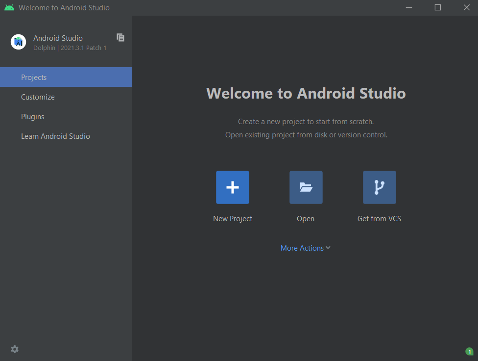
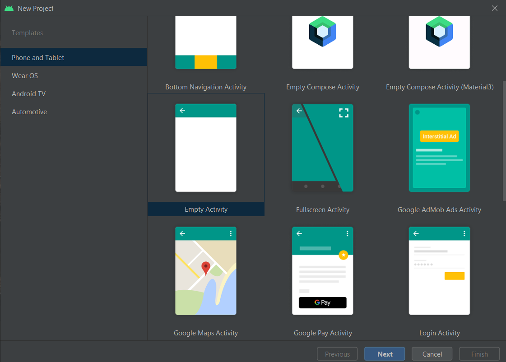
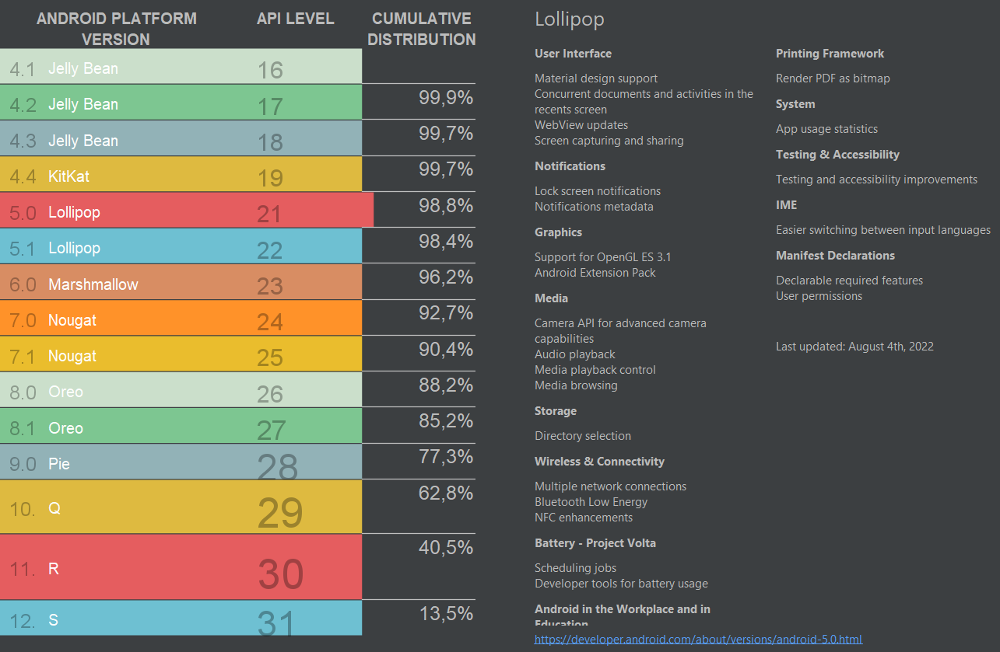
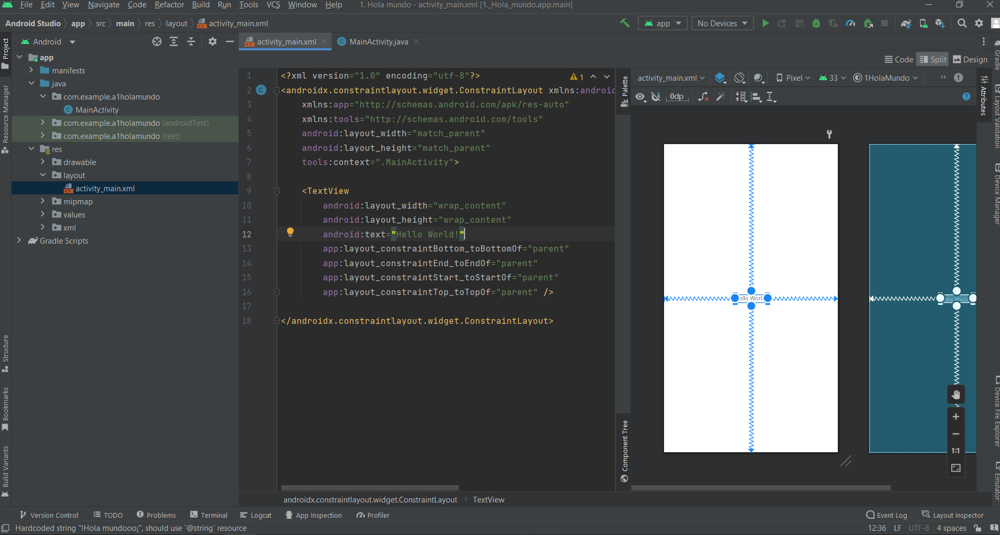
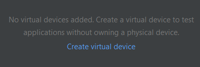
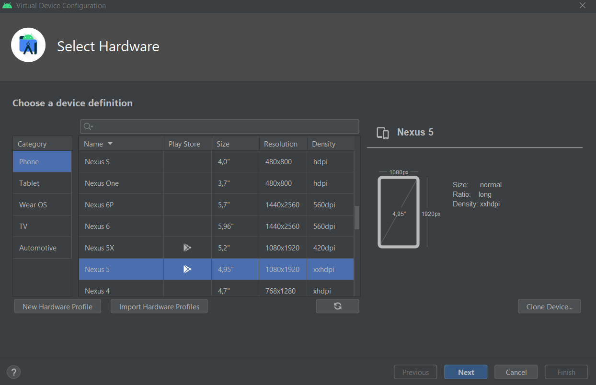

# 1. Instalacion

Vamos a la web y nos descargamos la aplicación para el SO que necesitemos.

[https://developer.android.com/studio](https://developer.android.com/studio)

Una vez descargado vamos a crear nuestro primer proyecto

---

## ¿Como crear un proyecto?

Vamos al apartado de Proyectos → New Proyect

<p align="center">
  
</p>


Tendremos que estar en el **apartado de móviles y tablets** y seleccionamos esta opción.

<p align="center">
  
</p>

Le tendremos que dar un nombre, ubicación en la que se localizara…

<p align="center">
  
</p>

### ¿Que versión de android usamos?

Si nos vamos al enlace que aparece en azul nos mostrara una tabla como esta

<p align="center">
  
</p>

Aqui podemos ver que version es la mas usada en el mercado, esto significa que si nos vamos a la version mas usada tendremos un “software” un poco limitado, pero si nos vamos a la versión mas nueva que tendra funciones muy utiles no sera tan utilizada ya que hay menos dispositivos que la tienen

Por eso es recomendable ir a un punto intermedio en nuestro caso usaremos API 26: Android 8.0 (Oreo)

Una vez creado el proyecto nos iremos a la carpeta **************************************************res → layout → activity_main.xml**************************************************

<p align="center">
  
</p>

Dentro de ****************TextView**************** añadimos esto

```xml
android:text="!!Hola mundoo¡¡"
android:rotationX="38"
android:rotationY="33"
android:textSize="34sp"
android:textStyle="bold"
```

## ¿Como se ejecuta?

---

Para eso nos tenemos que ir arriba a la derecha de la pantalla y añadir un dispositivo

<p align="center">
  
</p>

<p align="center">
  
</p>

<p align="center">
  
</p>

<p align="center">
  
</p>

Ahora indicamos con que orientación de pantalla se iniciara la aplicación.

<p align="center">
  
</p>

Una vez cargado el telefono que indicamos anteriormente le daremos al boton verde de play situado arriba a la derecha y nos saldra una ventana como esta.

<p align="center">
  
</p>