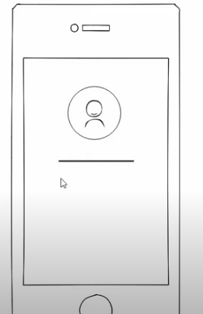

# 11. Diseño del splash

## ¿Qué es un wireframe?

Son paginas en las que creamos un boceto de como queremos que sea el diseño de nuestra aplicación [MockFlow](https://www.mockflow.com)

Vamos a crear una aplicación que tenga como pestaña de inicio este diseño.

  

