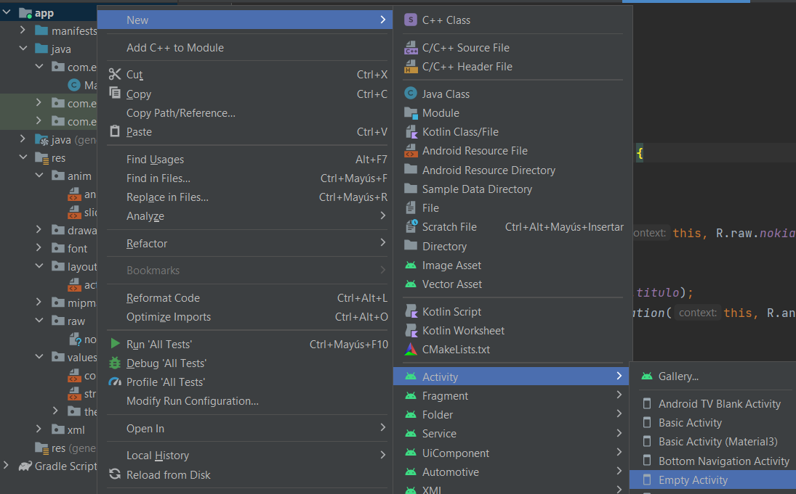
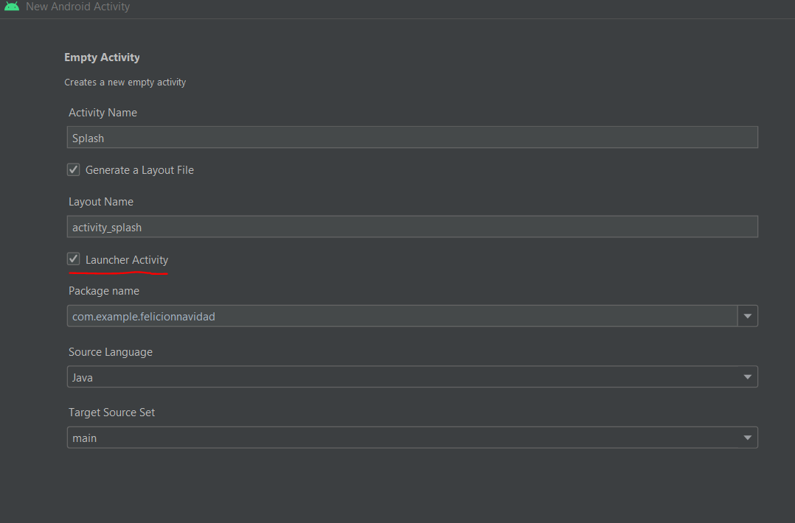
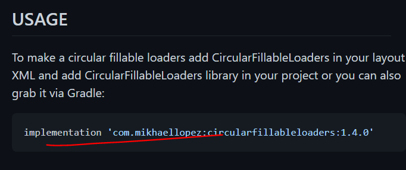
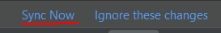
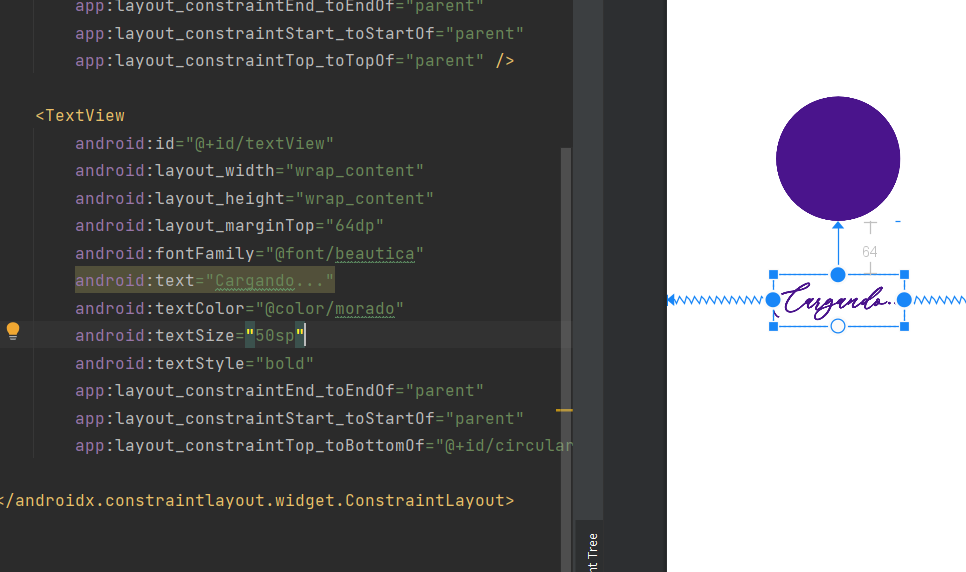

# 12. Tarjeta de felicitación 7 - Splash 1

Para crear el splash tendremos que hacer lo siguiente

|  |  |
| ------------- | ------------- |

Una vez creado nos vamos a manifest→AndroidManifest.xml y en el tramo que le pertenece a MainActivity eliminamos esto.

```java
<intent-filter>
  <action android:name="android.intent.action.MAIN" />
  <category android:name="android.intent.category.LAUNCHER" />
</intent-filter>
```

| Nos vamos a este [github](https://github.com/lopspower/CircularFillableLoaders) y copiamos el código que aparece aquí. |  |
| ------------- | ------------- |


Ahora vamos a este archivo y añadimos el tramo copiado en el apartado de dependencias.

<p align="center">
  
</p>

```java
dependencies {
  implementation 'com.mikhaellopez:circularfillableloaders:1.4.0'
}
```

Ahora nos vamos al activity_splash.xml la interfaz del recurso que acabamos de añadir

```xml
<com.mikhaellopez.circularfillableloaders.CircularFillableLoaders
  android:id="@+id/circularFillableLoaders"
  android:layout_width="wrap_content"
  android:layout_height="wrap_content"
  android:src="@drawable/your_logo"
  app:cfl_border="true"
  app:cfl_border_width="12dp"
  app:cfl_progress="80"
  app:cfl_wave_amplitude="0.06"
  app:cfl_wave_color="#3f51b5" />
```
| <!-- -->      | <!-- -->        |
|:-------------|:---------------|
| Al añadirlo nos saldrá un error en todo el tramo nuevo      | Esto se debe a que hicimos un cambio en el compilador y cada vez que se hace un cambio tenemos que **actualizar el proyecto**       |
|||

Al añadirlo nos saldrá un error en todo el tramo nuevo

<p align="center">
  
</p>


---

### Por ultimo vamos a **ocultar la barra que aparece arriba de la aplicación**.

<p align="center">
  
</p>


Para eso añadimos en el archivo java que pertenezca a esa ventana esta linea.

```java
getSupportActionBar().hide();
```

---

# Resultado final

<p align="center">
  
</p>