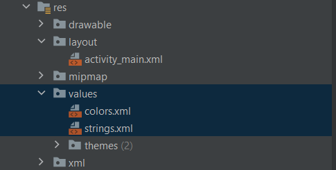
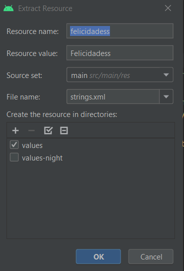

# 4. Tarjeta de Felicitación 1

Android maneja tanto los colores como los strings de una manera peculiar y es la siguiente

### Manejo en xml

En la carpeta res→values 

  

Podemos encontrar 2 archivos en los que se localizaran los textos y colores que utilizara nuestra app esto se podría decir que es una centralización ya que hace mas rápido los cambios de textos/colores.

|  |  |
| ------------- | ------------- |

Cuando le damos a ok lo que va a ocurrir es que donde antes estaba el texto ahora tendremos una referencia al valor de la variable que se localizara en el archivo **strings.xml**

|  |  |
| ------------- | ------------- |

Pasa lo mismo con los colores

|  |  |
| ------------- | ------------- |

Tambien podemos cambiar el tamaño, posicion… podemos hacerlo desde la ventana de diseño

  

