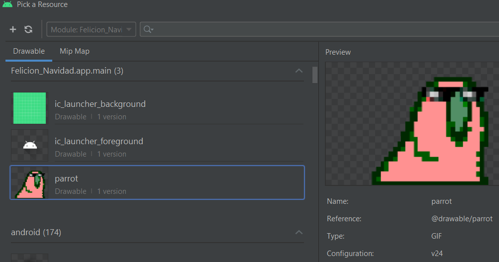
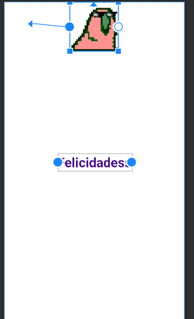
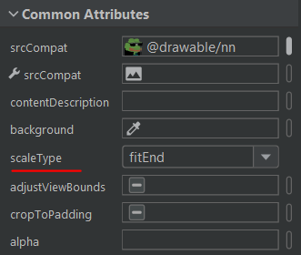
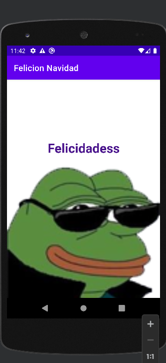

# 5. Tarjeta Felicitación 2

Ahora vamos a aprender a agregar un “”fondo”” a nuestra aplicación para eso necesitaremos una imagen.

Vamos a la carpeta drawable y colocamos la foto.

  

Una vez añadida nos vamos a la pestaña de diseño y arrastramos la opción imageview

  

E indicamos cual queremos

  

Una vez añadido tendremos que fijar 2 puntos de “referencia” uno en eje vertical y otro en horizontal

|  |  |
| ------------- | ------------- |

Ahora hacemos que tenga el tamaño que quiere (en mi caso lo puse del tamaño de la pantalla)

⚠️Seguramente nuestro texto no se vera ahora tendremos que moverlo de posición⚠️

| Antes      | Ahora       |
|:-------------:|:---------------:|
|  |  |

Por ultimo podemos utilizar estas opciones para posicionar nuestra foto

  

Resultado final

  

⚠️No se pueden usar gif de la manera que se acaba de mostrar⚠️