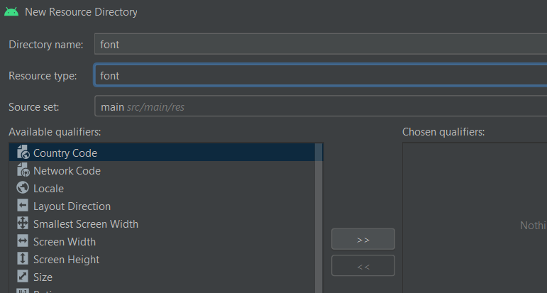

# 6. Tarjeta Felicitación 3 - fuentes

En esta web hay muchos recursos como fotos que te pueden ser útiles para crear la app [freepik](https://www.freepik.es) también se puede usar [dafont](https://www.dafont.com/es/) pero es solo para fuentes

Para guardar las fuentes en nuestra app tendremos que crear una carpeta que se localice dentro de res


|  |  |
| ------------- | ------------- |

⚠️El nombre del archivo .ttf que se añadirá a esta carpeta tiene que estar en **minúsculas y sin espacios**⚠️

Una vez añadido este archivo a la carpeta en el xml del texto que deseamos vamos a cambiar a añadir esto.

```xml
android:fontFamily="@font/beautica"

<!-- ****************
  El @font hace referencia a la carpeta que acabamos de crear
  Y el beautica al nombre de la funte (que se tiene que encontrar ahi)
-->
```

<p align="center">
  
</p>
