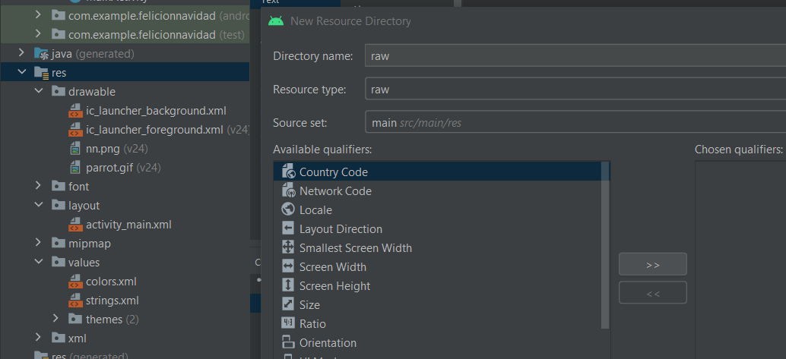

# 7. Tarjeta Felicitación 4 - música

En caso de dudas aquí hay una guía donde se explica como añadir el mediaplayer en Andorid [Developer Android](https://developer.android.com/guide/topics/media/mediaplayer)

Empezamos creando una carpeta en el directorio res es importante que tenga el mismo nombre y tipo.

|  |  |
| ------------- | ------------- |


Añadimos un archivo .mp3 a la carpeta raw como en la [explicación de fuentes](https://www.notion.so/7-Tarjeta-Felicitaci-n-3-fuentes-de2b454979434f839384f22af7466bf0) el archivo tiene que estar en **minúsculas y sin espacios**

Ahora nos en el archivo MainActivity.java y creamos el objeto mediaPlayer

```java
MediaPlayer mediaPlayer = MediaPlayer.create(this, R.raw.nokia_arabe_tono);
```

⚠️Explicación de la URI⚠️

1. La clase R es la que tiene todos los recursos de nuestro proyecto 
2. Raw es la carpeta que contiene los .mp3
3. nokia_arabe_tono es el archivo al que vamos a hacer referencia este no tendremos que indicar  la extensión .mp3

Ahora arrancaremos la canción

```java
mediaPlayer.start();
```