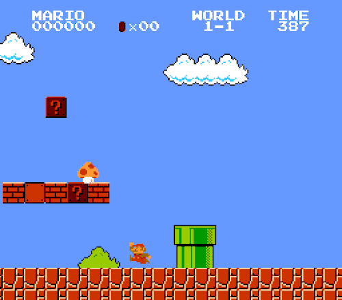
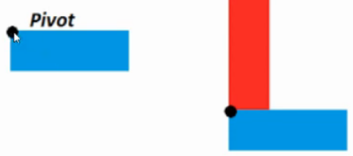

# 8. Animaciones Básicas

Hay varios **TIPOS de animación**

|**Traslación**|**Rotación**|
|:-------------:|:---------------:|
|Movimiento de un objeto|Hacer que gire el objeto|
|  |  |
|**Escala**|**Alpha**|
|Cambiar el tamaño del objeto|Hace que un objeto desaparezca modificando su opacidad|
|  |  |


Es muy importante saber donde esta el pivote (punto del parte la animación)

Ejemplo→ el pivote de este cuadrado se localiza en el centro ya que el cuadrado gira alrededor de el.

<p align="center">
  
</p>

---

## Xml de rotación

1. duration → 1000 = 1 segundo
2. fillAfter → al finalizar el tiempo indicado esta regresa a su estado inicial.
3. fromDegress → decimos desde que grado iniciaremos la animación en este caso 0.
4. pivotX → pivote del **eje X** al indicar 50% estamos diciendo que se localizara en el centro de ese eje
5. pivotY → pivote del **eje Y** al indicar 50% estamos diciendo que se localizara en el centro de ese eje
6. toDegrees → decimos hasta que grado queremos llegar para terminar la animación -90

Si empezamos en 0 y terminamos en -90 significa q girara en sentido contrario a las agujas del reloj

```xml
<rotate xmlns:andoid="http:schemas.andoid.com/apk/res/android"
  android:duration="3000"
  android:fillAfter="true"
  android:fromDegrees="0"

  android:pivotX="50%"
  android:pivotY="50%"
  android:toDegrees="-90" />
```

</br>

|Si el pivot <u>NO</u> esta en el centro|Si el pivot <u>SI</u> esta en el centro|
| ------------- | ------------- |
|  |  |

---

## Xml de traslación
<table>
	<tbody>
		<tr>
			<td>1. duration → 1000 = 1 segundo</td>
			<td rowspan=6></td>
		</tr>
		<tr>
			<td>2. fillAfter → al finalizar el tiempo indicado esta regresa a su estado inicial.</td>
		</tr>
		<tr>
			<td>3. fromXDelta → punto X de inicio para la animación</td>
		</tr>
		<tr>
			<td>4. fromYDelta → punto Y de inicio para la animación</td>
		</tr>
		<tr>
			<td>5. toXDelta → punto X de fin para la animación</td>
		</tr>
		<tr>
			<td>6. toYDelta → punto Y de fin para la animación</td>
		</tr>
	</tbody>
</table>

</br>

```xml
<translate xmlns:andoid="http:schemas.andoid.com/apk/res/android"
  android:duration="3000"
  android:fillAfter="true"
  android:fromXDelta="0"
  android:toXDelta="200"
  android:fromYDelta="0"
  android:toYDelta="200" />
```

---

## Xml de escala

1. duration → 1000 = 1 segundo
2. fillAfter → al finalizar el tiempo indicado esta regresa a su estado inicial.
3. fromXScale → valor inicial en X para la escala
4. fromYScale → valor inicial en Y para la escala
5. toXScale → valor final en X
6. toYScale → valor final en Y

Si toXScale **mayor** que fromXScale el objeto se hace mas grande.

Si toXScale **menor** que fromXScale el objeto se hace mas pequeño.

```xml
<escale xmlns:andoid="http:schemas.andoid.com/apk/res/android"
  android:duration="3000"
  android:fillAfter="true"
  android:fromXScale="0"
  android:toXScale="2"
  android:fromYScale="0"
  android:toYScale="2"
  android:pivotX="50%"
  android:pivotY="50%" />
```

---

## ¿Cómo arrancar las animaciones?

1. Necesitamos crear la animacion en xml.
2. Crearnos en la interfaz la view
3. Hacer una referencia a la ubicacion de la imagen

```java
ImageView imagen;
imagen = (ImageView) findViewById(R.id.imagen);
```

1. Cargar la animación con la clase Animation (tendrá que estar definido el archivo xml)

```java
Animation rotate = AnimationUtils.loadAnimation(this, R.anim.rotate_animation1);
imagen.startAnimation(rotate);
```