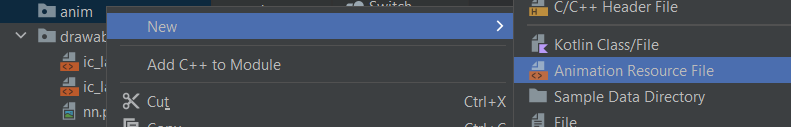

# 9. Tarjeta Felicitación 5 - animaciones

Para crear una animación tendremos que crearnos una carpeta en res

|  |  |
| ------------- | ------------- |

Después a la carpeta anim tendremos que

<p align="center">
  
</p>

Dentro tendremos este xml

```xml
<?xml version="1.0" encoding="utf-8"?>
<set xmlns:android="http://schemas.android.com/apk/res/android">

</set>
```

Le tendremos que añadir lo siguiente

```xml
<?xml version="1.0" encoding="utf-8"?>
<set xmlns:android="http://schemas.android.com/apk/res/android">

<!-- Escalado -->
  <scale
    android:duration="3000"
    android:pivotX="50%"
    android:pivotY="50%"
    android:fromXScale="0"
    android:fromYScale="0"
    android:toXScale="1"
    android:toYScale="1" />

<!-- Rotacion -->
  <rotate
    android:duration="3000"
    android:pivotX="50%"
    android:pivotY="50%"
    android:fromDegrees="0"
    android:toDegrees="360" />

</set>
```

En el xml de la pestaña en la que estemos tendremos que ver el id que tendrá como referencia el elemento TextView

```xml
<TextView
  android:id="@+id/titulo" />
```

```java
@Override
protected void onCreate(Bundle savedInstanceState) {
  TextView titulo = (TextView) findViewById(R.id.titulo);
  Animation animTitulo = AnimationUtils.loadAnimation(this, R.anim.anim_titulo);
  titulo.startAnimation(animTitulo);
}
```