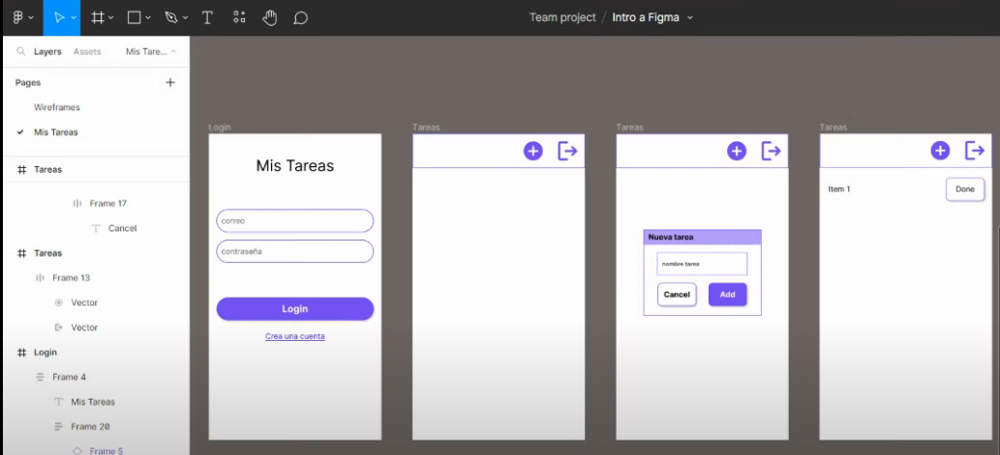

# 1. Diseño del proyecto

Para hacer un proyecto es aconsejable utilizar [figma](https://www.figma.com) esta aplicación web nos permite crear un diseño de como queremos que quede nuestro proyecto.

  

