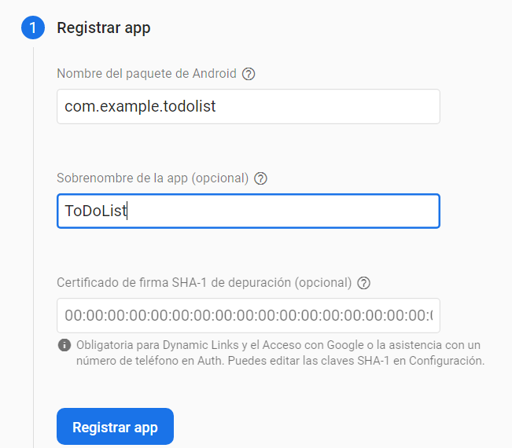
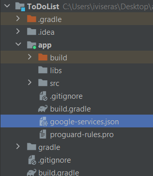

# 8. Configurar FireBase

Para utilizar fireBase mínimo tenemos que tener el Android 19 (KitKat) para ver que cumplimos el requisitos podemos ir a build.gradle (el nivel de app) y miramos el compileSdk

<p align="center">
  
</p>

---

Ahora tendremos que acceder a [fireBase](https://firebase.google.com/?hl=es) utilizando esto podemos tener una base de datos que se utilizara tanto para la app móvil como para la app web.

### ¿Cómo crear un proyecto?

1. Acceder a la [web](https://firebase.google.com/?hl=es) y darle al boton de comenzar.
    
    <p align="center">
      
    </p>
    
2. Le damos un nombre a nuestro poryecto
    
    <p align="center">
      
    </p>
    
3. En caso de desarrollar una app que se utilizara en la play store u otro sitio activar esta opción si lo vais a usar para pruebas y poco mas es mejor desactivarlo.
    
    <p align="center">
      
    </p>
    
4. Indicar para que dispositivo se utilizara

    <p align="center">
      
    </p>

1. Para poner el nombre del paquete android nos tendríamos que ir al build.gradle y colocar lo que aparece en namespace

|       |         |
|:-------------:|:---------------:|

1. Nos descargamos el archivo .json que nos da la web y lo tendremos que añadir en la ubicación que nos indican
    - Para eso tendremos que cambiar la vista de Andoid a la del proyecto
        
        <p align="center">
          
        </p>
        
    - Y añadir el archivo a la carpeta app
        
        <p align="center">
          
        </p>
        
2. Ahora vamos a build.gradle nivel (Proyecto)
    
    ```java
    buildscript {
      repositories {
        // Make sure that you have the following two repositories
        google()  // Google's Maven repository
    
        mavenCentral()  // Maven Central repository
    
      }
      dependencies {
        ...
        // Add the dependency for the Google services Gradle plugin
        classpath 'com.google.gms:google-services:4.3.15'
    
      }
    }
    ```
    
3. Ahora vamos a build.gradle nivel (app) y añadimos esto dentro de plugins
    
    ```java
    id 'com.google.gms.google-services'
    ```
    
    Y dentro de las dependencias esto
    
    ```java
    implementation platform('com.google.firebase:firebase-bom:31.2.0')
    implementation 'com.google.firebase:firebase-auth'
    implementation 'com.google.firebase:firebase-database'
    ```
    
4. En la web de firebase ya podemos darle a acceder a la consola
5. Vamos al AndroidManifest.xml y añadimos esto arriba del todo.
    
    ```java
    <uses-permission android:name="android.permission.INTERNET"/>
    <uses-permission android:name="android.permission.ACCESS_NETWORK_STATE"/>
    ```
    

1. Accionamos el botón para que se sincronice el proyecto con todos los cambios 

<p align="center">
  
</p>