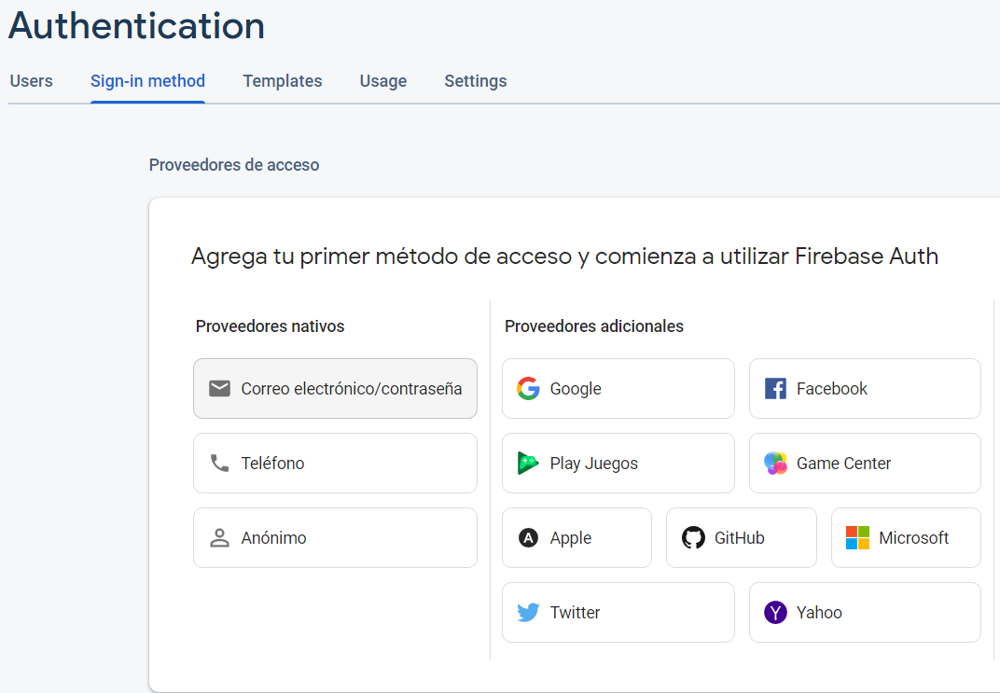

# 10. Login y registro - FireBase

Nos tendremos que ir al [firebase](https://console.firebase.google.com/project/todolist-41a1b/overview?hl=es) y dentro de nuestro proyecto vamos a la pestaña de autenticación


<p align="center">
  
</p>

Y elegimos el proveedor que queramos utilizar en nuestro caso usaremos el de correo electrónico.

|       |         |
|:-------------:|:---------------:|

Ahora accederemos a la [guía](https://firebase.google.com/docs/auth/android/start?hl=es) que tiene firebase y empezaremos a seguir los siguientes pasos.

1. En nuestro Login.java añadimos esto para declarar el firebase
    
    ```java
    private FirebaseAuth mAuth;
    ```
    
2. En el OnCreate lo inicializamos.
    
    ```java
    mAuth = FirebaseAuth.getInstance();
    ```
    

## Acción de registro

1. Lo primero necesitamos inicializar 2 variables en las que almacenaremos los datos de los campos Correo y contraseña de la ventana login
    
    ```java
    EditText emailText, passText;
    ```
    
2. Tenemos que instanciar las variables de antes en el OnCreate
    
    ```java
    emailText = findViewById(R.id.cajaCorreo);
    passText = findViewById(R.id.cajaContraseña);
    ```
    
3. Ahora en el OnCreate añadimos esto aquí es donde se hace la acción de crear el usuario en  la base de datos en caso de que se cree nos aparecerá en la web.
    
    ```java
    botonRegistro = findViewById(R.id.botonRegistro);
    botonRegistro.setOnClickListener(new View.OnClickListener() {
      @Override
      public void onClick(View view) {
    
        String email = emailText.getText().toString();
        String password = passText.getText().toString();
        //Crear usuario en firebase
        mAuth.createUserWithEmailAndPassword(email, password)
            .addOnCompleteListener(new OnCompleteListener<AuthResult>() {
              @Override
              public void onComplete(@NonNull Task<AuthResult> task) {
                if (task.isSuccessful()) {
                  //damos acceso al menu
                  Toast.makeText(Login.this, "Usuario Registrado", Toast.LENGTH_LONG).show();
                  Intent intent = new Intent(Login.this, MainActivity.class);
                  startActivity(intent);
                } else {
                  // En caso de que el usuario ya exista.
                  Toast.makeText(Login.this, "Este usuario ya existe.",
                  Toast.LENGTH_SHORT).show();
                }
              }
        });
      }

    });
    ```

</br> 
<p align="center">
  
</p>

## Acción de Login

Este método lo vamos a realizar con una acción lambda es recomendable usarlas ya que no sobrescribimos el método Onclick

1. Tendremos que añadir esto dentro del onCreate.
    
    ```java
    botonLogin = findViewById(R.id.botonLogin);
    botonLogin.setOnClickListener(view -> {
      String email = emailText.getText().toString();
      String password = passText.getText().toString();
    
      mAuth.signInWithEmailAndPassword(email, password)
          .addOnCompleteListener(this, new OnCompleteListener<AuthResult>() {
            @Override
            public void onComplete(@NonNull Task<AuthResult> task) {
              if (task.isSuccessful()) {
                //En caso de que sea correcto el user/passwd accedemos al main
                Intent intent = new Intent(Login.this, MainActivity.class);
                startActivity(intent);
              } else {
                //En caso de no dar un user/passwd correcto.
                Toast.makeText(Login.this, "Usuario incorrecto.",
                Toast.LENGTH_SHORT).show();
              }
            }
      });
    
    });
    ```