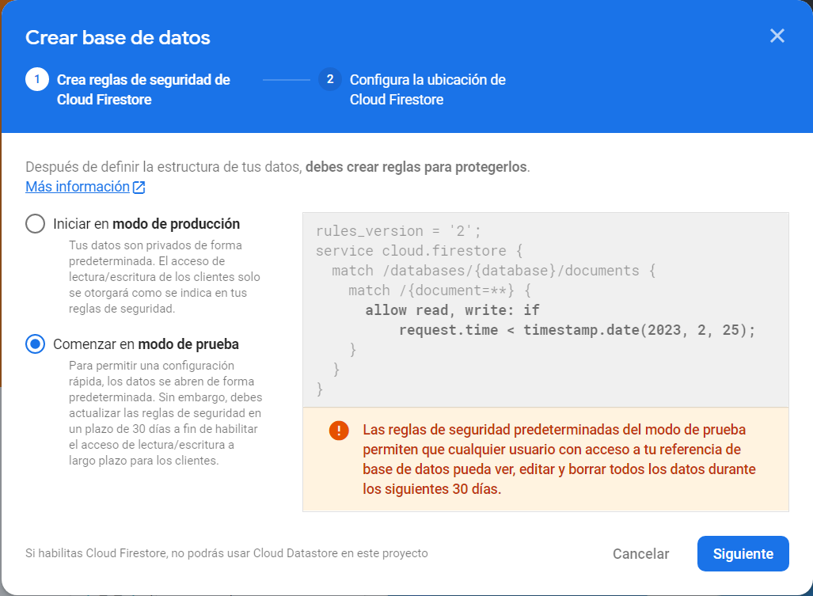
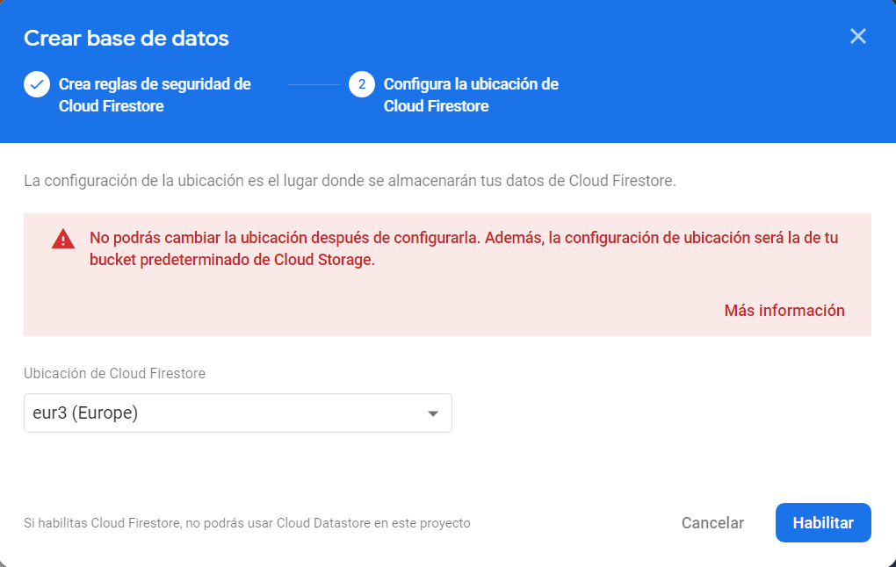
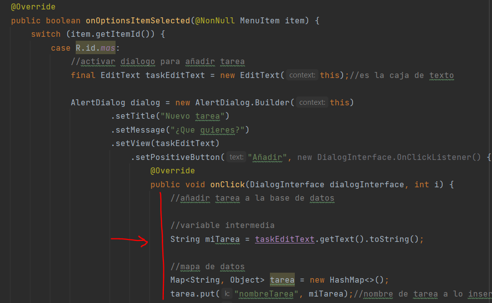

# 11. Altas, Bajas y consultas

Nos iremos a la ventana en la que nos muestra los elementos que podemos añadir a nuestro proyecto y accederemos a este

<p align="center">
  
</p>

Le daremos a crear base de datos.

<p align="center">
  
</p>

Ahora nos saldrán 2 pestañas
<table>
	<tbody>
		<tr>
			<td>1. Marcaremos esta opción la principio pero ya que estamos desarrollando la app</br></br><b>Pero tendremos que cambiarlo cuando queramos dar acceso a los usuarios.<b></td>
			<td>2. Tenemos que indicar la ubicación del servidor que queremos utilizar lo mejor seria el mas próximo a nosotros.</td>
		</tr>
		<tr>
			<td></td>
			<td></td>
		</tr>
	</tbody>
</table>


En la pestaña de reglas vamos a modificar la que se generada por defecto por esta.
Haciendo este cambio vamos a permitir la lectura y escritura mientras que el usuario este logeado

```java
rules_version = '2';
service cloud.firestore {
  match /databases/{database}/documents {
    match /{document=**} {
      allow read, write: if
        request.time != null;
    }
  }
}
```

Ahora nos vamos a la pestaña de Datos y creamos una nueva colección.

|       |         |
|:-------------:|:---------------:|

Ahora podríamos ir a la zona de pruebas y podemos comprobar si las acciones que indicamos se pueden realizar o no.

<p align="center">
  
</p>

Nos vamos a nuestro build.gradle y añadimos esto dentro de las dependencias

```java
implementation 'com.google.firebase:firebase-firestore'
```

En el MainActibity.java añadimos la declaracion al firebaseFirestore

```java
FirebaseFirestore db;
```

Ademas de eso en nuestro caso tendremos que declarar lo siguiente para asi poder manejar los datos y poder mostrar las tareas.

```java
String emailUsuario;

ListView listViewTareas;
List<String> listaTareas = new ArrayList<>();
List<String> listaIdTareas = new ArrayList<>();
ArrayAdapter<String> mAdapterTarea;
```

Ahora en el OnCreate guardamos las instancias del fireStore y del authentication

```java
//instanciaciones 
db = FirebaseFirestore.getInstance();
mAuth = FirebaseAuth.getInstance();

//variable intermedia para acceder a los datos
emailUsuario = mAuth.getCurrentUser().getEmail();
listViewTareas = findViewById(R.id.ListView);
```

Ahora nos vamos al método onOptionsItemSelected a la acción del cuadro de dialogo y añadimos esto es la declaración de un mapeo de datos.

<p align="center">
  
</p>

```java
//variable intermedia
String miTarea = taskEditText.getText().toString();

//mapa de datos
Map<String, Object> tarea = new HashMap<>();

//nombre de tarea a lo insertado en la caja de texto
tarea.put("nombreTarea", miTarea);

//correponde a este usuario
tarea.put("emailUsuario", emailUsuario);
```

```java
//añadimos la tarea a la base de datos
db.collection("Tareas").add(tarea);
```

### ¿Cómo recibimos datos de una colección?

En este caso estamos sacando los datos en tiempo real estamos siguiendo esta [guía](https://firebase.google.com/docs/firestore/query-data/listen?hl=es) 

```java
public void actualizarUI(){
  db.collection("Tareas")
      .whereEqualTo("emailUsuario", emailUsuario)
      .addSnapshotListener(new EventListener<QuerySnapshot>() {
        @Override
        public void onEvent(@Nullable QuerySnapshot value,
                            @Nullable FirebaseFirestoreException e) {
          if (e != null) {

            return;
          }

          //limpiamos las listas
          listaTareas.clear();
          listaIdTareas.clear();

          for (QueryDocumentSnapshot doc : value) {
            listaIdTareas.add(doc.getId());
            listaTareas.add(doc.getString("nombreTarea"));
          }
          //si la lista esta vacia
          if (listaTareas.size() == 0){
            listViewTareas.setAdapter(null);//el usuario no tiene docs
          }else{//tiene datos la lista
            mAdapterTarea = new ArrayAdapter<String>(MainActivity.this, R.layout.item_tarea, R.id.nombreTarea, listaTareas);
            listViewTareas.setAdapter(mAdapterTarea);
          }

        }
      });
}
```

Luego tenemos que hacer un llamamiento a este en el OnCreate del MainActivity para que asi se ejecute la acción.