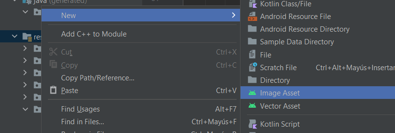
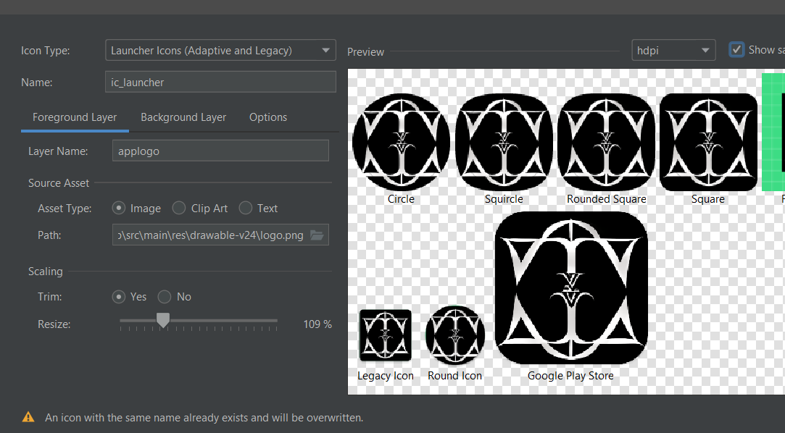

# 13. Acciones en Eventos

### Cambiar logo app

Accedemos a la siguiente pestaña

<p align="center">
  
</p>

Y tenemos que indicarla foto que queremos que sea para nuestra app en mi caso coloque la foto en res/drawable/

|       |         |
|:-------------:|:---------------:|

### Iconos para la app

Podemos entrar a [flaticon](https://www.flaticon.es) y buscar algún logo que nos sea útil para nuestra app en mi caso utilizare una cruz.

Una vez descargado uno, lo guardamos en res/drawable despues nos vamos al archivo xml en el que lo queremos usar.

| Colocar icono      | Dar tamaño al icono        | Dar color al icono        |
|:-------------:|:---------------:|:---------------:|
|`app:icon="@drawable/cerca"`|`app:iconSize="20dp"`|`app:iconTint="@color/white"`|

<p align="center">
  
</p>


### Icono a la derecha

 

```xml
android:drawableRight="@drawable/cerca"
```