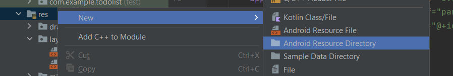
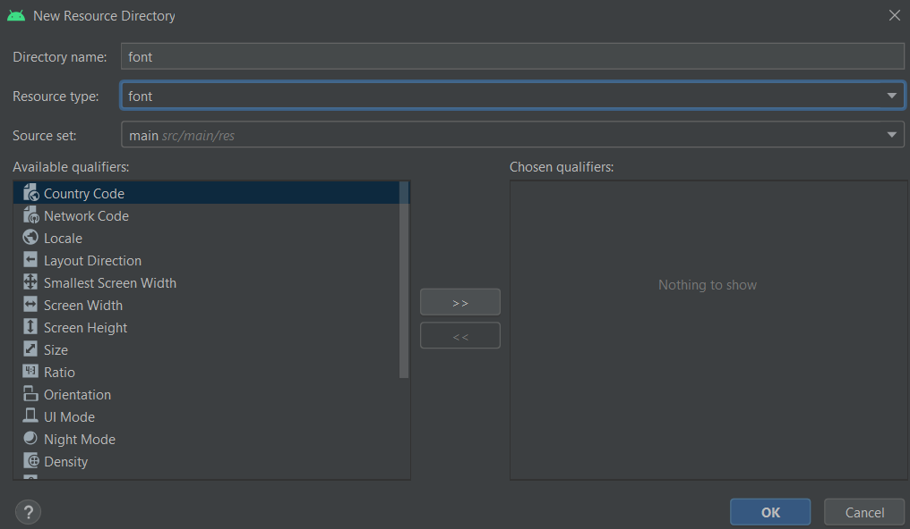
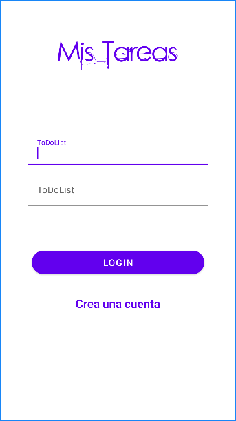

# 2. Pantalla Login

Para la pantalla de login tendremos que crear una nueva pestaña muy importante marcar la opción de Launcher Activity

|  |  |
| ------------- | ------------- |

Vamos a la carpeta manifest→ AndoridManifest.xml y eliminamos esto

<p align="center">
  
</p>

En la carpeta de res creamos una carpeta destinada para fuentes y añadimos nuestra fuente

|  |  |
| ------------- | ------------- |


Y este seria el codigo xml para crear nuestra ventana de Login

```xml
<?xml version="1.0" encoding="utf-8"?>
<androidx.constraintlayout.widget.ConstraintLayout xmlns:android="http://schemas.android.com/apk/res/android"
  xmlns:app="http://schemas.android.com/apk/res-auto"
  xmlns:tools="http://schemas.android.com/tools"
  android:layout_width="match_parent"
  android:layout_height="match_parent"
  tools:context=".Login">

  <TextView
    android:id="@+id/Titulo"
    android:layout_width="wrap_content"
    android:layout_height="wrap_content"
    android:layout_marginTop="56dp"
    android:text="Mis Tareas"
    android:textColor="@color/purple_500"
    android:textSize="50sp"
    android:fontFamily="@font/fuente"
    app:layout_constraintEnd_toEndOf="parent"
    app:layout_constraintStart_toStartOf="parent"
    app:layout_constraintTop_toTopOf="parent" />

  <com.google.android.material.textfield.TextInputLayout
    android:layout_width="314dp"
    android:layout_height="wrap_content"
    android:layout_marginTop="72dp"
    app:layout_constraintEnd_toEndOf="parent"
    app:layout_constraintStart_toStartOf="parent"
    app:layout_constraintTop_toBottomOf="@+id/Titulo"
    android:id="@+id/layautCorreo" >

    <com.google.android.material.textfield.TextInputEditText
      android:layout_width="314dp"
      android:layout_height="wrap_content"
      android:hint="@string/hintCorreo"
      android:id="@+id/cajaCorreo"
      android:textColorHint="@color/purple_200"
      android:textSize="16sp"
      android:backgroundTint="@color/white" />
    <!--android:textColorHint="@color/purple_200"   Para el color de las letras-->
    <!--android:textSize="16sp"                      Para el tamaño de la letra-->
    <!--android:backgroundTint="@color/white   Para el color de fondo de la caja-->

    <requestFocus/><!--Para que se marque al iniciar-->
  </com.google.android.material.textfield.TextInputLayout>

  <com.google.android.material.textfield.TextInputLayout
    android:id="@+id/layautContraseña"
    android:layout_width="314dp"
    android:layout_height="wrap_content"
    android:layout_marginTop="16dp"
    app:layout_constraintEnd_toEndOf="parent"
    app:layout_constraintStart_toStartOf="parent"
    app:layout_constraintTop_toBottomOf="@+id/layautCorreo" >

    <com.google.android.material.textfield.TextInputEditText
      android:id="@+id/cajaContraseña"
      android:layout_width="314dp"
      android:layout_height="wrap_content"
      android:hint="@string/hintContraseña"
      android:textColorHint="@color/purple_200"
      android:textSize="16sp"
      android:backgroundTint="@color/white"/>

      <!--android:textColorHint="@color/purple_200"   Para el color de las letras-->
      <!--android:textSize="16sp"                      Para el tamaño de la letra-->
      <!--android:backgroundTint="@color/white   Para el color de fondo de la caja-->
  </com.google.android.material.textfield.TextInputLayout>

  <Button
    android:id="@+id/buttonLogin"
    android:layout_width="301dp"
    android:layout_height="52dp"
    android:layout_marginTop="72dp"
    android:backgroundTint="@color/purple_500"
    android:text="@string/login"
    android:textSize="16sp"
    app:cornerRadius="32sp"
    app:layout_constraintEnd_toEndOf="parent"
    app:layout_constraintHorizontal_bias="0.505"
    app:layout_constraintStart_toStartOf="parent"
    app:layout_constraintTop_toBottomOf="@+id/layautContraseña" />

  <TextView
    android:id="@+id/crearCuenta"
    android:layout_width="wrap_content"
    android:layout_height="wrap_content"
    android:layout_marginTop="32dp"
    android:text="Crea una cuenta"
    android:textColor="@color/purple_500"
    android:textSize="20sp"
    android:textStyle="bold"
    app:layout_constraintEnd_toEndOf="parent"
    app:layout_constraintStart_toStartOf="parent"
    app:layout_constraintTop_toBottomOf="@+id/buttonLogin" />

</androidx.constraintlayout.widget.ConstraintLayout>
```

Y este seria nuestro resultado

<p align="center">
  
</p>