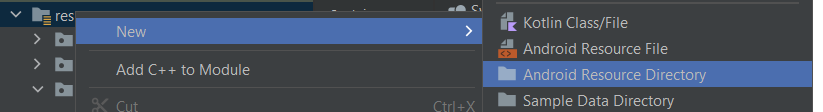
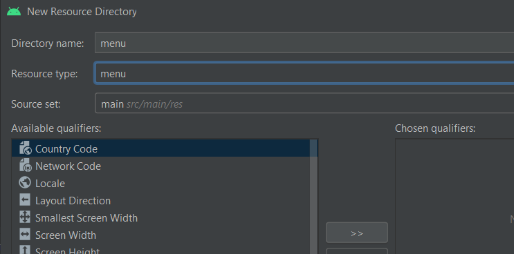
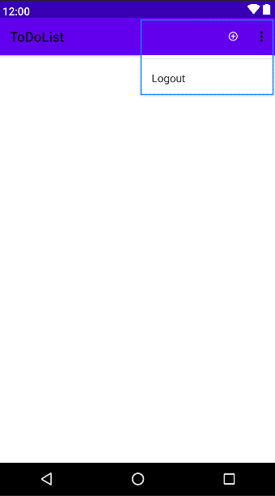

# 3. appBar

Es recomendable usar [materialdesingicon](https://pictogrammers.com/library/mdi/) u otra web como [font.google](https://fonts.google.com/icons?selected=Material+Icons&icon.query=logout) en la que podamos descargar iconos para asi usarlos en nuestra app.

Creamos un directorio de trabajo Android de tipo menu.

|  |  |
| ------------- | ------------- |

En el activity_main borramos el textView que hay y creamos el xml que usaremos que se ubicara en la carpeta menu

|  |  |
| ------------- | ------------- |


## menu.xml

```xml
<?xml version="1.0" encoding="utf-8"?>
<menu xmlns:android="http://schemas.android.com/apk/res/android"
    xmlns:app="http://schemas.android.com/apk/res-auto"
    xmlns:tools="http://schemas.android.com/tools"
    tools:context=".MainActivity">

    <!--Tenemos que colocar esto dentro de la etiqueta menu
    xmlns:tools="http://schemas.android.com/tools"
    tools:context=".MainActivity"
    Usando esto hacemos que la pestaña de menu pueda aparecer el menu
    en el mainActivity-->
  <item
    android:id="@+id/mas"
    android:title="@string/mas"
    android:icon="@mipmap/mas"
    app:showAsAction="always"/>

  <item
    android:id="@+id/logout"
    android:title="@string/logout"
    android:icon="@mipmap/logout"
    app:showAsAction="never"/>
    <!--Se utiliza para que aparezca en el menu overflow
        app:showAsAction="never"-->

</menu>
```

<p align="center">
  
</p>

## MainActivity.java

Tenemos que añadir esto para que se pueda mostrar el menu

```java
@Override
public boolean onCreateOptionsMenu(@NonNull Menu menu) {
  getMenuInflater().inflate(R.menu.menu, menu);
  return super.onCreateOptionsMenu(menu);
}
```

Menuitem item → la variable item tiene como parámetro un ID esto nos servirá para diferenciar que botón a sido pulsado este id es el mismo que se coloca en el elemento item 

```java
//Para dar acciones a los botones del menu menu.xml
@Override
public boolean onOptionsItemSelected(@NonNull MenuItem item) {
  switch (item.getItemId()) {
    case R.id.mas:
      //
      return true;
    case R.id.logout:
      //
      return true;
    default: return super.onOptionsItemSelected(item);
  }

}
```

---

## Login.java

```java
public class Login extends AppCompatActivity {

  Button botonLogin;

  @Override
  protected void onCreate(Bundle savedInstanceState) {
    super.onCreate(savedInstanceState);
    setContentView(R.layout.activity_login);

    getSupportActionBar().hide();

    botonLogin = findViewById(R.id.botonLogin);
    botonLogin.setOnClickListener(new View.OnClickListener() {
      @Override
      public void onClick(View view) {
        Intent intent = new Intent(Login.this, MainActivity.class);
        startActivity(intent);
      }
    });
  }

}
```