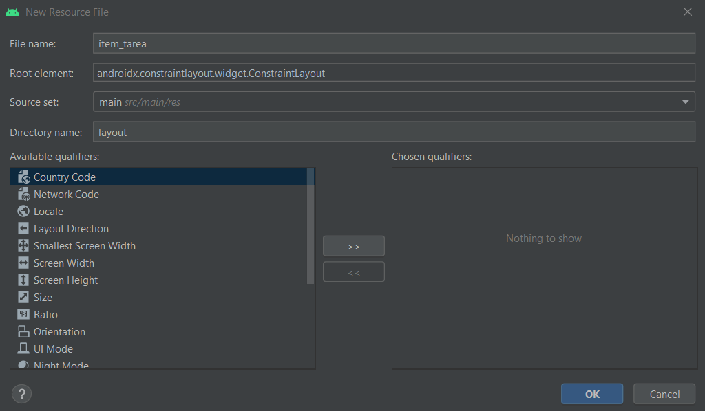

# 7. ListView

Para generar un listView tenemos que ir a activity_main.xml 

1. Buscar la etiqueta listView 
2. Añadirlo a la ventana
3. Marcarlo a los 4 extremos de la pantalla con la distancia que deseemos 

<p align="center">
  
</p>

⚠️En los tamaños del layaout lo cambie para que se alinee con el padre⚠️

```java
android:layout_width="match_parent"
android:layout_height="match_parent"
```

### Ahora tendremos que definir el contenido que tendrá

1. Para eso vamos a layout y añadimos un nuevo fichero de recursos.

|       |         |
|:-------------:|:---------------:|

Dentro del xml añadimos este codigo

```java
<?xml version="1.0" encoding="utf-8"?>
<androidx.constraintlayout.widget.ConstraintLayout xmlns:android="http://schemas.android.com/apk/res/android"
  xmlns:app="http://schemas.android.com/apk/res-auto"
  xmlns:tools="http://schemas.android.com/tools"
  android:layout_width="match_parent"
  android:layout_height="match_parent">

  <TextView
    android:id="@+id/textView"
    android:layout_width="wrap_content"
    android:layout_height="wrap_content"
    android:layout_marginStart="24dp"
    android:layout_marginTop="32dp"
    android:text="TextView"
    app:layout_constraintStart_toStartOf="parent"
    app:layout_constraintTop_toTopOf="parent" />

  <Button
    android:id="@+id/button"
    android:layout_width="wrap_content"
    android:layout_height="wrap_content"
    android:layout_marginTop="16dp"
    android:layout_marginEnd="32dp"
    android:text="Button"
    app:layout_constraintEnd_toEndOf="parent"
    app:layout_constraintTop_toTopOf="parent" />
</androidx.constraintlayout.widget.ConstraintLayout>
```