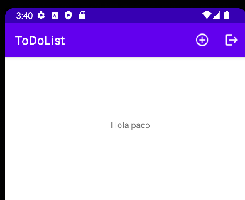

# 9. Comunicación entre activities

Lo que queremos hacer es poder mover un dato de una ventana a otra para eso.

Vamos al MainActivity.java y añadimos la implementación del método y nos generara un método **Onclick**

```java
implements View.OnClickListener
```

Aquí estaríamos pasando un dato de una ventana a otra

```java
@Override
public void onClick(View view) {
  Intent intent = new Intent(this, MainActivity.class);
  EditText nombreUsuario = findViewById(R.id.cajaCorreo);
  intent.putExtra("nombre", nombreUsuario.getText().toString());
  startActivity(intent);
}
```

Para que eso se pueda ejecutar le tenemos que añadir esto en el **OnCreate**

```java
findViewById(R.id.botonLogin).setOnClickListener(this);
```

### MainActivitiy.java

Dentro del **OnCreate** colocamos estopara que se reciban los parámetros en la pestaña del main

```java
String nombre = getIntent().getStringExtra("nombre");
TextView etiquetaNomUser = findViewById(R.id.nombreUser);
etiquetaNomUser.setText("Hola " + nombre);
```

|       |         |
|:-------------:|:---------------:|