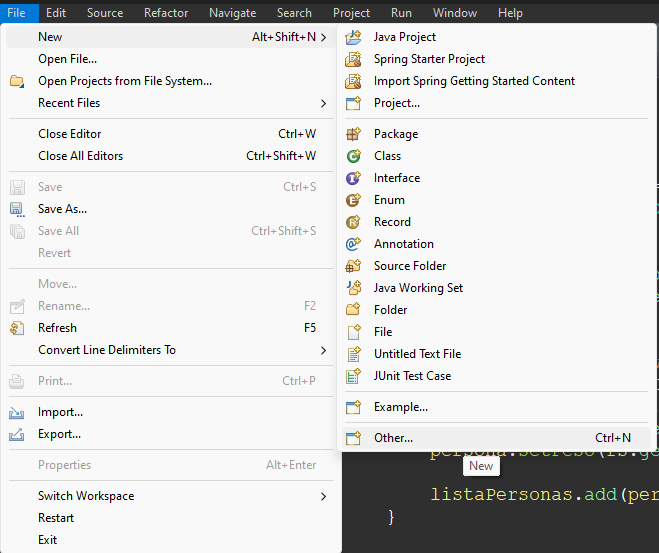
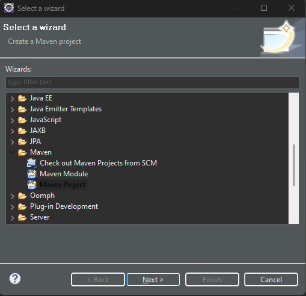
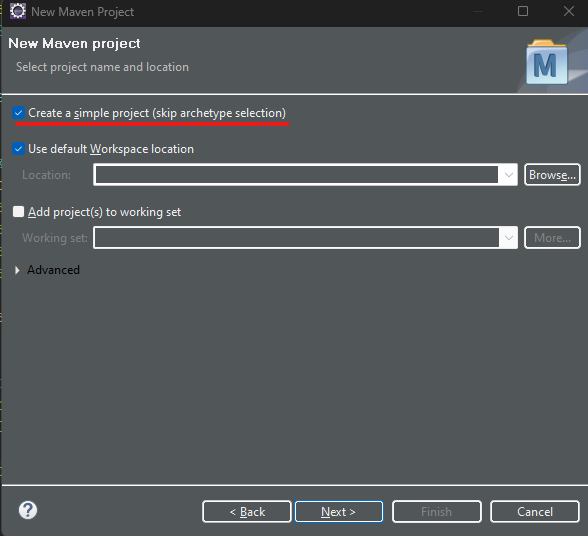
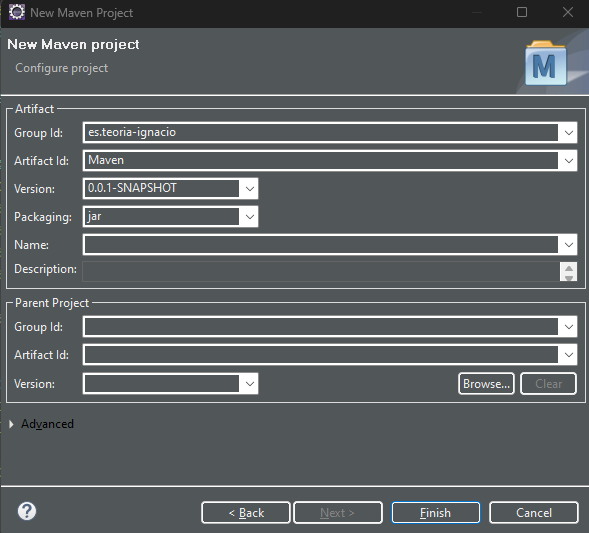
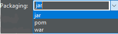
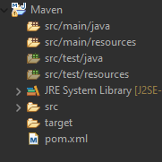
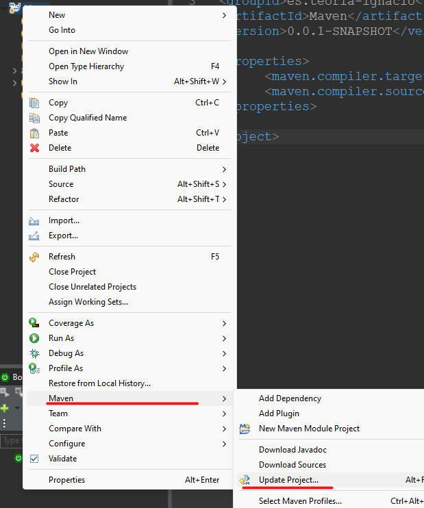

# 9. Maven

**Maven** → Es una herramienta que se utiliza para la gestión y construcción de proyectos java.
Nos permitirá importar librerías de terceros de una manera mas simple.

# ¿Cómo crear un proyecto Maven?
<p align="center">
  
</p>


|||
|:-------------:|:---------------:|

**Artifact id** → Es el nombre del proyecto

**Group id** → Es para el grupo al que pertenece (ej: Empresa a la que pertenece es.carrefour)

<p align="center">
  
</p>

**jar** → el proyecto se comprimirá en un .jar

**pom** → el proyecto se podrá subir a la plataforma de maven para así poder importarlo en otros proyectos

**war** → el proyecto se comprimirá en un .war esto será útil para desplegar aplicaciones web

<p align="center">
  
</p>

**main/java** → Ficheros fuentes del proyecto

**main/resources** → Archivos de configuración o archivos necesario para el funcionamiento (ej: un txt que tiene que ser leído al arrancar la aplicación)

**test/java** → Pruebas para los ficheros fuente del proyecto

**test/resources** → Pruebas para los archivos de configuración

**src** → Cada vez que guardemos el proyecto se copiara en esta carpeta NO PODEMOS TRABAJAR SOBRE ELLA **es recomendable ignorarla**

**Maven Dependencies** → Aquí se localizan las dependencias java

**target** → Se localizan los ejecutables de nuestro proyecto

**pom** → Es el fichero mas importante en los proyectos maven, aquí se controla desde la versión de java que usaremos, las librerías que importaremos o como generamos el ejecutable/desplegable del proyecto

<p align="center">
  
</p>

## pom.xml

Para cambiar la versión de java que estamos usando en el proyecto solo tenemos que añadir esto al pom

```xml
<properties>
    <maven.compiler.target>1.8</maven.compiler.target>
    <maven.compiler.source>1.8</maven.compiler.source>
</properties>
```

> **IMPORTANTE** → Cada vez que cambiamos algo importante en el pom es recomendable actualizar el proyecto Maven para que pille los cambios.
> 

<p align="center">
  
</p>

- Para añadir librerías al pom visitamos esta web [MVNRepository](https://mvnrepository.com/repos/central) y buscamos la que queramos utilizar
- Una vez encontrado la librería que queremos buscamos que versión queremos y copiamos el xml.
- En el pom añadimos una etiqueta <dependencies> y dentro colocaremos las librerías

```xml
<dependencies>

    <!-- https://mvnrepository.com/artifact/mysql/mysql-connector-java -->
    <dependency>
      <groupId>mysql</groupId>
      <artifactId>mysql-connector-java</artifactId>
      <version>8.0.29</version>
    </dependency>
  
</dependencies>
```

Una vez guardado en la carpeta Maven Dependencies ya se habrán añadido y configurado los .jar que necesitare para mi proyecto.
