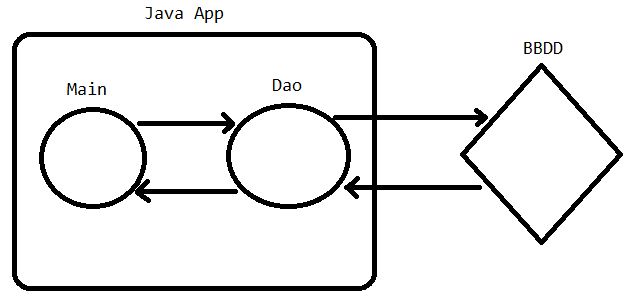
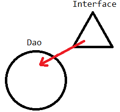

# 7. Patrón Dao - 1

DAO → Data Access Object

> No es obligatorio que la comunicación sea con una bbdd, puede ser con ficheros……
> 

Gracias al patrón dao podremos realizar el intercambio de información con la base de datos fuera del main de tal manera que estaremos liberando un poco las acciones en este.

<p align="center">
  
</p>

> Los Dao **implementan una interfaz**
> 
> 
> Con esta interfaz estamos obligando al dao a utilizar unos métodos en concreto como mínimo, estos métodos estarán definidos en la interfaz
> 

<p align="center">
  
</p>

```java
//Aqui tenemos los metodos que se implementaran obligatoriamente en el dao

//CRUD =
//      CREATE
//      READ
//      UPDATE
//      DELETE

public interface IntPersonaDao {

  Boolean alta(Persona p);
  Boolean baja(int id);
  Boolean modificar(Persona p);
  Persona obtener(int id);
  List<Persona> listar();
}
```