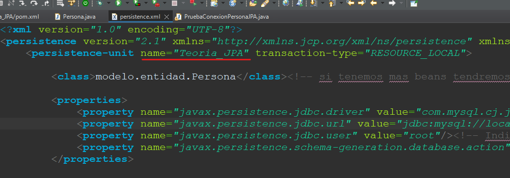

# 3. Entidad Unica - 2

# Comprobar la conexión con la base de datos

Para trabajar con JPA necesitamos un objeto `EntityManager`, nos permitirá:

- Abrir/Cerrar las conexiones con la base de datos.
- Realizar las transacciones.
- Cacheara en memoria las consultas realizadas para así liberar la base de datos.

Para crear un objeto `EntityManager` tendrá que estar apoyado en una `EntityManagerFactory` dicha factoría estará asociada a una unidad de persistencia definido en el persistance.xml

```java
EntityManagerFactory factoria = Persistence.createEntityManagerFactory("Teoria_JPA");
EntityManager em = factoria.createEntityManager();
```
<p align="center">
  
</p>

# Creación de una persona

Tendremos que usar el `EntityManager` para realizar la comunicación

```java
EntityManagerFactory factoria = Persistence.createEntityManagerFactory("Teoria_JPA");
EntityManager em = factoria.createEntityManager();
```

> Como en el Bean de Persona se le indico que el id fuera autoincremental no tendremos que indicarlo.
> 

```java
Persona p = new Persona();
//id autoincremental
p.setNombre("Juan Alberto");
p.setEdad(45);
p.setPeso(70);
```

### Acciones en la base de datos

Cuando hagamos acciones en la bd (inserts, deletes, updates...) tendremos que abrir un canal de transaccionalidad.

1. Abrimos canal de transaccionalidad.
2. Empezamos la transacción.
3. Guardamos el objeto persona en la bd.
4. Hacemos commit de la consulta.

```java
EntityTransaction et = em.getTransaction();//1
et.begin();//2
em.persist(p);//3
et.commit();//4
```

Una vez realizado estos pasos cerramos el `EntityManager`

```java
em.close();
```

# Modificar una persona

Para modificar una persona tendremos que empezar realizando la comunicación con la bd usando `EntityManager` 

```java
EntityManagerFactory factoria = Persistence.createEntityManagerFactory("Teoria_JPA");
EntityManager em = factoria.createEntityManager();
```

> Para modificar un registro de la bd tendremos que indicar el id que queremos modificar (ya que el id es la Primary Key del objeto)
> 

```java
Persona p = new Persona();
p.setId(1);//le tenemos que pasar el id del objeto que queremos modificar
p.setNombre("Manolo");
p.setEdad(30);
p.setPeso(50);
```

### Acciones en la base de datos

Cuando hagamos modificaciones en la bd tendremos que abrir un canal de transaccionalidad.

1. Abrimos canal de transaccionalidad.
2. Empezamos la transacción.
3. **Modificamos** el objeto persona en la bd utilizando `merge`.
4. Hacemos commit de la consulta.

```java
EntityTransaction et = em.getTransaction();//1
et.begin();//2
em.merge(p);//3
et.commit();//4
```

Una vez realizado estos pasos cerramos el `EntityManager`

```java
em.close();
```

# Obtener una persona

Abrimos conexión con la base de datos

```java
EntityManagerFactory factoria = Persistence.createEntityManagerFactory("Teoria_JPA");
EntityManager em = factoria.createEntityManager();
```

> Como no vamos a realizar modificaciones en la bd **NO** tendremos un entrono de transacciones `EntityTransaction`
> 
1. Para realizar el find tendremos que pasarle 2 parametros
    1. La clase del objeto que queremos recibir (En Beans se le indica a que tabla pertenece)
    2. El id que tendrá este (Ya que es la Primary Key)

```java
Persona p = em.find(Persona.class, 1);//1
System.out.println(p);
```

# Listar personas

Abrimos conexión con la base de datos

```java
EntityManagerFactory factoria = Persistence.createEntityManagerFactory("Teoria_JPA");
EntityManager em = factoria.createEntityManager();
```

> from Personas p -> NO es una sentencia/query al uso **es una sentencia JPQL**
> 
- **Persona** hace referencia a la clase y la **p** es el alias
- from Personas p → select * from Personas

```java
List<Persona> listPersonas = em.createQuery("from Persona p").getResultList();
for(Persona p : listPersonas) {
  System.out.println(p);
}
```

Una vez realizado la consulta cerramos el `EntityManager`

```java
em.close();
```

# Borrar una persona

Abrimos conexión con la base de datos

```java
EntityManagerFactory factoria = Persistence.createEntityManagerFactory("Teoria_JPA");
EntityManager em = factoria.createEntityManager();
```

> Para borrar un elemento de la bd en JPA tenemos que tenerlo en la cache de `EntityManager` esto se consigue buscándolo.
> 

```java
int id = 1;
Persona p = em.find(Persona.class, id);
```

Como ya esta cacheado el objeto que queremos borrar abrimos la transacción `EntityTransaction`

```java
EntityTransaction et = em.getTransaction();
et.begin();
em.remove(p);//borramos la persona
et.commit();
```

Una vez realizado la consulta cerramos el `EntityManager`

```java
em.close();
```