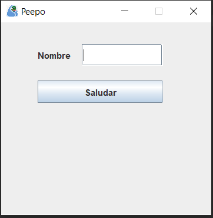

# Creación de Componentes

### ¿Qué es un componente?

Todo lo que se ve en un GUI de Java es un componente. Los componentes se colocan en otros elementos llamados contenedores que sirven para agrupar componentes.

Ejemplos:

- JLabel → Etiqueta de texto estándar
- JButton → Botón estándar
- JTextField → Cuadro de texto
- JCheckBox → Casilla de verificación
- JRadioButton → Botones de opción
- JComboBox → Lista desplegable

⚠️Todos los componentes que tendrá la ventana se declaran al principio de la clase.⚠️

```java
private JLabel etiqueta;
private JTextField cajaTexto;
private JButton boton;
```

Una vez declaradas creamos una función en la que utilizaremos los componentes declarados anteriormente, para así solo tener que llamarlo en el constructor.

Para añadir componentes tendremos que seguir estos 3 pasos

1. Crear
2. Dar tamaño y posición
3. Añadir 
    
```java
private void inicializarComponentes() {
  etiqueta = new JLabel("Nombre");//1
  etiqueta.setBounds(50, 30, 50, 30);//2
  add(etiqueta);//3

  cajaTexto = new JTextField();//1
  cajaTexto.setBounds(110, 30, 110, 30);//2
  add(cajaTexto);//3

  boton = new JButton("Saludar");//1
  boton.setBounds(50, 80, 170, 30);//2
  add(boton);//3
}
```
    

Siempre que añadimos componentes en una ventana hay un organizador que va recolocando esto se llama **layout** como los vamos a colocar manualmente tendremos que desactivarlo.

Esto se hace en el constructor antes de llamar a la función en la que se localiza los componentes

```java
public VentanaPrincipal() {
  setLayout(null);//desactivamos el layout
  inicializarComponentes();
}
```

Resultado final

<p align="center">
  
</p>
