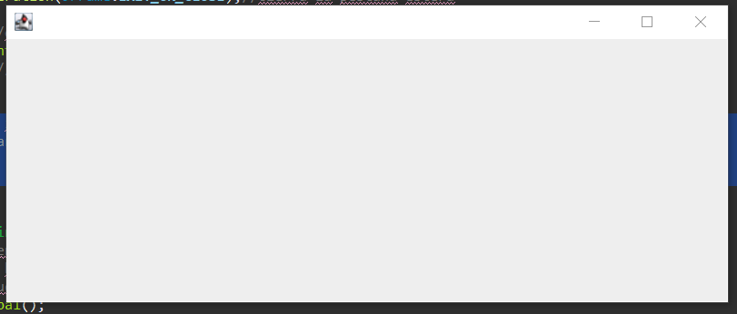

# 4. Gestión de Eventos III-SIN MVC

⚠️**Si quieres hacer una gestión de eventos SIN MVC es recomendable que sea para ventanas que no requieran muchas cosas**⚠️

---

Vamos a practicar algunos de los diferentes eventos que nos ofrece java en concreto vamos a hacer que se nos cambie una foto cuando pasemos el ratón por encima.

En concreto vamos a crear una ventana con una foto, cuando pasemos el cursor por encima **mouseEntered()** cambiaremos de imagen y cuando salgamos **mouseExited()** vuelva a la anterior.

| Interface | Método |
| --- | --- |
| MouseListener | mouseEntered(KeyEvent e) 💭Se ha entrado (con puntero del ratón) en un componente.💭 |
| MouseListener | mouseExited(KeyEvent e) 💭Se ha salido (con puntero del ratón) en un componente💭 |

</br>
Además de eso añadiremos unos checkbox lo cual tendremos que comprobar el estado de este stateChanged()

| Interface | Método | Métodos del evento “e” |
| --- | --- | --- |
| ChangeListener | stateChanged(ChangeEvent e) 💭Ha cambiado el estado (seleccionado/deseleccionado).💭 | Object getSource() 💭Obtiene el objeto fuente que ha lanzado el evento💭 |

</br>
Un botón que cuando se utilice se abrirá una ventana modal

| Interface | Método | Métodos del evento “e” |
| --- | --- | --- |
| ActionListener | actionPerformed(ActionEvent e) 💭Se hizo click en el componente💭 | Object getSource() 💭Obtiene el objeto fuente que ha lanzado el evento💭 |

<br></br>
### ⚠️🚨Todo esto se realizará sin controlador es decir, en una sola clase🚨⚠️

Para eso cuando creamos la clase le tendremos que indicar que nos genere un main.

La clase tendrá que heredar de JFrame

```java
public class VentanaPrincipal extends JFrame{
}
```

Además nos crearemos un constructor de la clase en el que indicaremos: tamaño ubicación acción al cerrarse…. 

🆘Puedes ver la explicación de como hacer esto en [1. Ventana Principal](https://github.com/ignacioviseras/Pruebas-variadas/blob/main/pruebas_swing_Java/1.PrimeraVentana/Readme.md)🆘

```java
public VentanaPrincipal() {
  //el orden de creacion de la ventana da igual lo unico 
  //importante es que la indicacion de que sea visible se ubique al final.

  setSize(650,270);//indicamos el tamaño
  setLocationRelativeTo(null);//al ser null aparecera en el centro de la pantalla
  setDefaultCloseOperation(JFrame.EXIT_ON_CLOSE);//cierra la pestaña estera
	
  setLayout(null);//desactivamos el layout
  inicalizarComponentes();//llamada a la funcion
  setVisible(true);//hacemos que sea visible
}
```

La función inicalizarComponentes() que llamamos en el constructor es donde crearemos los botones, cajas de texto…… todo esto queda explicado en [2. Creación de Componentes](https://github.com/ignacioviseras/Pruebas-variadas/blob/main/pruebas_swing_Java/2.CreacionDeComponentes/Readme.md) la dejamos vacía pero luego introduciremos componentes dentro de ella.

```java
//Como es una funcion interna la ponemos privada
private void inicalizarComponentes() {
	
}
```

Para crear la ventana tendremos que instanciar VentanaPrincipal en el main como no vamos a hacer nada mas con ella podemos crearla y no asignarle valor de tal manera que cuando se ejecute nos la mostrara y no se guardara.

```java
public static void main(String[] args) {
  new VentanaPrincipal();
}
```

Cuando ejecutemos la aplicación nos saldrá en el centro de la pantalla una ventana así.

<p align="center">
  
</p>

Como nosotros queremos colocar una imagen en esa ventana tendremos que hacer lo siguiente:

Guía rápida para añadir una foto:

carpeta src → creas un paquete → buscas la foto que desees en tu equipo → la arrastras dentro del paquete que creaste anteriormente. 
<p align="center">
  
</p>

<p align="center">
  
</p>

Como no existe ningún componente para las imágenes lo que tendremos que hacer es usar JLabel→ Etiqueta de texto estándar

```java
private JLabel imagen;

//Como es una funcion interna la ponemos privada
private void inicalizarComponentes() {
  getContentPane().setBackground(Color.WHITE);//Color de fondo blanco
	
  //el JLaberl en vez de contener una cadena de texto que seria lo normal
  //contendra una imagen -> para eso tendremos q crear un objeto el cual 
  //le indicaremos la ruta.
  imagen = new JLabel(new ImageIcon("imagenes/nn.png"));
  imagen.setBounds(0, 0, 300, 270);//cordenadas 0x 0y / y tamaño width 300 height 270
  add(imagen);//añadimos la imagen a la ventana
}
```

Una vez guardado nos quedaría una cosa así.

<p align="center">
  
</p>

Ahora vamos a hacer que cuando se pase el ratón por encima se nos cambie la fotografía por otra.

Para eso tendremos que añadir una segunda fotografía y usaremos un **MouseListenner** para detectar cuando se para el ratón por encima ***mouseEntered*** y cuando salga fuera del objeto ***mouseExited***

```java
private void inicalizarComponentes() {
  //⚠️⚠️Esto es la continuación de la funcion mostrada anteriormente⚠️⚠️

  //Cuando creamos un objeto de MouseListener
  //tendremos que implementar toda la interfaz de este.
  //utilizaremos solo el que necesitemos-> mouseEntered
  imagen.addMouseListener(new MouseListener() {
    @Override
    public void mouseReleased(MouseEvent e) {
      // TODO Auto-generated method stub
    }

    @Override
    public void mousePressed(MouseEvent e) {
      // TODO Auto-generated method stub
    }

    //Se ejecutara cuando ente el raton encima de la foto
    @Override
    public void mouseEntered(MouseEvent e) {
      imagen.setIcon(new ImageIcon("src/imagenes/gato2.jpg"));
    }

    //Se ejecutara cuando salga el raton encima de la foto
    @Override
    public void mouseExited(MouseEvent e) {
      imagen.setIcon(new ImageIcon("src/imagenes/gato1.jpg"));
    }

    @Override
    public void mouseClicked(MouseEvent e) {
    // TODO Auto-generated method stub
		
    }
  });

}
```

Cuando lo ejecutemos tendremos algo así

Cuando colocas el ratón encima 

<p align="center">
  
</p>

Cuando lo quitas 

<p align="center">
  
</p>

Ahora añadiremos un checkbox y un botón.

Para eso los declaramos como atributo de la clase.

```java
private JButton boton;
private JCheckBox checkbox;
```

Empezaremos con el checkbox

```java
private JCheckBox checkbox;

private void inicalizarComponentes() {
  //⚠️⚠️Esto es la continuación de la funcion mostrada anteriormente⚠️⚠️
	
  checkbox = new JCheckBox("Aceptar términos");//declaramos el checkbox
  checkbox.setBounds(350, 50, 150, 30);//tamaño y pos
  checkbox.setBackground(Color.WHITE);//color de fondo

  //⚠️Mismo caso que con la imagen añadimos la interfaz ChangeListener⚠️
  checkbox.addChangeListener(new ChangeListener() {
    //aqui indicamos que ocurrira cuando se haga click en el checkbox.
    @Override
    public void stateChanged(ChangeEvent e) {
      if(checkbox.isSelected()) {//si esta seleccionado
        boton.setEnabled(true);//activamos el boton
      }else {//si NO esta activado
        boton.setEnabled(false);//desactivamos el boton
      }
    }
  });
  
  add(checkbox);//lo añadimos
}
```

Botón

```java
private JButton boton;

private void inicalizarComponentes() {
  //⚠️⚠️Esto es la continuación de la funcion mostrada anteriormente⚠️⚠️

  boton = new JButton("Continuar");//declaramos el boton
  boton.setBounds(350, 100, 145, 30);//tamaño y pos

  //este boton no se podra usar hasta que se acepten las condiciones
  boton.setEnabled(false);
  boton.addActionListener(new ActionListener() {//Añadimos la interfaz de ActioListener
    //Esto se accionara cuando el boton sea clicado
    @Override
    public void actionPerformed(ActionEvent e) {
      JOptionPane.showMessageDialog(null, "POP", "Esto es el titulo", JOptionPane.PLAIN_MESSAGE);//esto es una "ventana emergente"
    }
  });
  
  add(boton);//lo añadimos
}
```

Así se vería cuando le hacemos aceptemos las condiciones y le demos al botón.

<p align="center">
  
</p>
