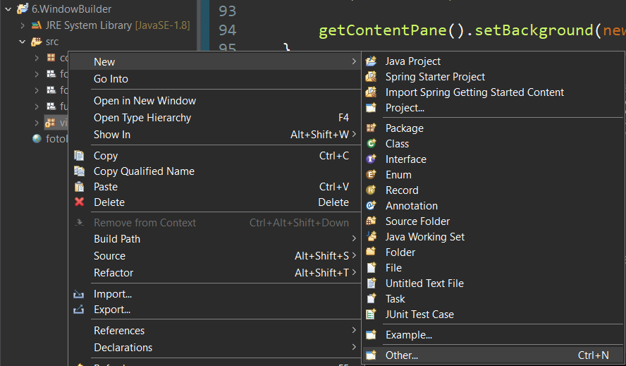

# 6. WindowBuilder

## JFrame vs JDialog

---

### JFrame

- Es la ventana principal, aparecerá en la barra de herramientas con su icono correspondiente.

### JDialog

- Tiene una ventana padre **(JFrame no admite esto)**
- Puede ser una ventana modal **(JFrame no podría serlo)**

## WindowBuilder

---

## ¿Qué es?

- Es un plugin que nos facilita la creación de ventanas utilizando una interfaz grafica.

## ¿Cómo añadirlo al IDE?

- En el caso de eclipse tendríamos que ir a la pestaña de Help→ Eclipse Marketplace y buscamos WindowBuilder Current

## ¿Cómo utilizarlo?

1. Una vez este instalado nos dirigimos al paquete vista sobre el hacemos click y vamos a New→Other..
    
	<p align="center">
  		
	</p>
    
    
2. Dentro de Other seleccionamos ****WindowBuilder→JDialog y le damos un nombre.****

	<p align="center">
  		
	</p>

1. Una vez creado nuestro archivo es recomendable quitar el main que nos crean por defecto en el archivo ya que ese no será nuestro main principal.
2. Nos vamos a la pestaña Desing que se ubica debajo del código. Y tendremos la siguiente pestaña.
    
	<p align="center">
  		
	</p>
    
    <p align="center">
  		
	</p>
    
    
    ⚠️Si cuando intentas editar algo te salta un error de versión es pq tienes que tener una versión de eclipse mas nueva en mi caso estoy usando la 22.09⚠️
    
3. Cuando añadimos un label e intentamos moverlo no nos dejara colocarlo libremente eso se soluciona clicando en la ventana interior (lo morado) y cambiamos el Layout a absoluto

<p align="center">
   
</p>

Para que nos quede la ventana así.
<p align="center">
  
</p>

Tendremos que poner los siguientes valores

|Titulo|Botón Volver|
|---|---|
|||


Si hacemos dobleclick en el botón volver se nos abrirá en el código el actionListener correspondiente, le indicaremos dentro que cuando sea clicado se cierre la pestaña.

```java
botonCerrar.addActionListener(new ActionListener() {
  public void actionPerformed(ActionEvent e) {
    dispose();//cerrar la ventana
  }
});
```

---

## Conexión de ventanas

Ahora vamos a conectar VentanaPrincipal con VentanaSecundaria

```java
public void actionPerformed(ActionEvent e) {
  ////⚠️Acceder⚠️
  if(e.getSource() == ventana.getBoton()) {
    VentanaSecundaria ventana2 = new VentanaSecundaria();//abrimos la ventanaSecundaria
    ventana2.setVisible(true);//⚠️ponemos el setVisible ya que en el constructor no esta
  }
  
  //BotonReset
  if (e.getSource() == ventana.getBotonReset()) {
    ventana.getCajaTexto().setText("");
    ventana.getCajaTexto().requestFocus();//nos activara la caja de texto
  }
}
```
