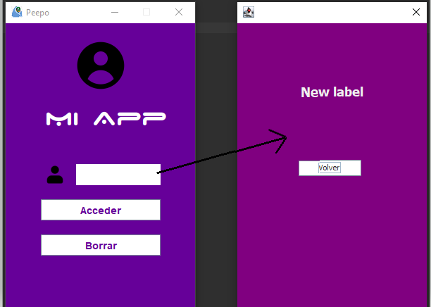

# 7. Comunicación entre ventanas

Queremos enviar el valor de la cajaTexto→ventanaPrincipal a la ventanaSecundaria

<p align="center">
  		
</p>


Para eso tendremos que ir a VentanaSecundaria.java y crearemos un método que podamos llamar en la ventanaPrincipal.

```java
private JLabel etiquetaSaludo;

public void establecerTexto(String nombreUsuario) {
  etiquetaSaludo.setText(nombreUsuario);
}
```

De esta manera en ventanaPrincipal.java le pasaremos el contenido

```java
public void actionPerformed(ActionEvent e) {
  ////Acceder
  if(e.getSource() == ventana.getBoton()) {
    VentanaSecundaria ventana2 = new VentanaSecundaria();
    ventana2.establecerTexto(ventana.getCajaTexto().getText());//⚠️pasamos el dato a ventan2
    ventana2.setVisible(true);//ponemos el set visible ya que en el constructor no esta
  }
}
```

⚠️🚨Tendremos que quitar JLabel de la declaracion en el constructor🚨⚠️

```java
public VentanaSecundaria() {
  JLabel etiquetaSaludo = new JLabel("New label");//Antes
  etiquetaSaludo = new JLabel("New label");//Ahora
}
```

<p align="center">
  		
</p>

---

## Vamos a modificar el botón volver sacándolo del constructor

### VentanaSecundaria.java

- Tendremos que crearnos un get del BotonCerrar
    
    ```java
    public JButton getBotonCerrar() {
      return botonCerrar;
    }
    ```
    

- Modificaremos el ActionListener de BotonCerrar para que se reciba la indicación del ManejadorEventos.java.
    
    ```java
    private JButton botonCerrar;
    private ManejadorEventos controlador;
    
    public VentanaSecundaria(ManejadorEventos controlador) {
      this.controlador = controlador;
    
      //BotonCerrar
      botonCerrar.addActionListener(controlador);
    }
    ```
    

### ManejadorEventos.java

- Solo tendremos que añadir un nuevo if al que le pasaremos la acción de cerrar **además de pasarle el objeto a la ventanaSecundaria**
    
    ```java
    private VentanaSecundaria ventana2;
    
    public void actionPerformed(ActionEvent e) {
      ////Acceder
      if(e.getSource() == ventana.getBoton()) {
        ventana2 = new VentanaSecundaria(this);//⚠️⚠️⚠️Añadimos el this para que lo reciba el actListener⚠️
        ventana2.establecerTexto("Bienvenid@ " + ventana.getCajaTexto().getText());
        ventana2.setVisible(true);//ponemos el set visible ya que en el constructor no esta
      }
    
      //⚠️BotonCerrar⚠️
      if (e.getSource() == ventana2.getBotonCerrar()) {
        ventana2.dispose();//cerramos la ventana
      }
    }
    ```
