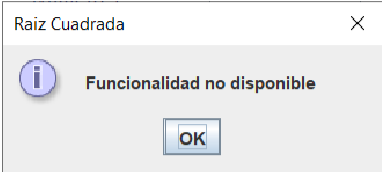
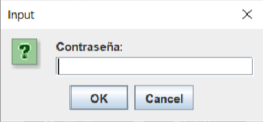

# Documentación

<ol>
    <li><a href="https://github.com/ignacioviseras/Teoria/tree/main/Java/4.%20Swing/1.PrimeraVentana">Primera Ventana</a></li>
    <li><a href="https://github.com/ignacioviseras/Teoria/tree/main/Java/4.%20Swing/2.CreacionDeComponentes">Creacion de Componentes</a></li>
    <li><a href="https://github.com/ignacioviseras/Teoria/tree/main/Java/4.%20Swing/3.GestionEventos_1-2">Gestion Eventos 1 - 2</a></li>
    <li><a href="https://github.com/ignacioviseras/Teoria/tree/main/Java/4.%20Swing/4.GestionEventos_3_Sin_MVC">Gestion Eventos 3 Sin MVC</a></li>
    <li><a href="https://github.com/ignacioviseras/Teoria/tree/main/Java/4.%20Swing/5.DandoEstilo_GUI">Dando Estilo GUI</a></li>
    <li><a href="https://github.com/ignacioviseras/Teoria/tree/main/Java/4.%20Swing/6.WindowBuilder">Window Builder</a></li>
    <li><a href="https://github.com/ignacioviseras/Teoria/tree/main/Java/4.%20Swing/7.%20Comunicación%20entre%20ventanas">Comunicación entre ventanas</a></li>

</ol>

+ Actividad para practicar los conocimientos

 

# AE-2. Calculadora

+ <a href="https://github.com/ignacioviseras/2-DAM/tree/main/Acceso%20a%20Datos/A3-%20JPA">Solución</a> de la Actividad

## **Requerimiento 1**

En este ejercicio vamos a crear una calculadora que realice las operaciones de sumar, restar,
multiplicar, dividir dos números, raíz cuadrada y cúbica. De momento nos vamos a centrar en su
funcionalidad, y el aspecto de nuestra calculadora será similar a este:

  

<h4>Aspectos a tener en cuenta:</h4>

+ Es fundamental que durante la ejecución de la aplicación no se produzcan excepciones ni
ningún tipo de error. Habrá que gestionarlos y tenerlos en cuenta desde el código. Probad
con la introducción de diferentes tipos de datos o dejando las cajas vacías. En todo momento
habrá que informar al asuario de las necesidades del programa.
+ El cursor deberá aparecerá en la caja de texto del primer número para facilitar al usuario la
entrada de los números.
+ Al pulsar sobre el botón de “raíz cuadrada”, aparecerá una ventana con el mensaje
“Funcionalidad no disponible”.

  

+ Al pulsar sobre el botón de “raíz cúbica”, nos aparecerá un cuadro de diálogo que nos pedirá
que introduzcamos una contraseña para poder acceder a esta funcionalidad. Si la contraseña
es correcta se realizará la operación

  

## Requerimiento 2

En esta parte vamos a mejorar la interfaz gráfica de nuestra calculadora, cuyo aspecto deberás
cambiar:
+ Color/imagen de fondo.
+ Cambiar el aspecto de los botones.
+ Cambiar la tipografía que viene por defecto.
+ Cambiar el icono de la aplicación y del ejecutable.

Este es un ejemplo para inspiraros, se valorará la creatividad:

  

