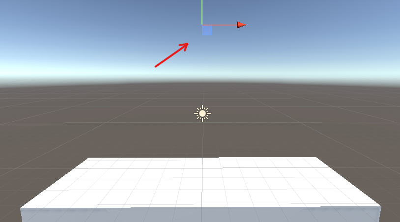

# Bombas 1

<table>
	<tbody>
		<tr>
			<td>Si nos vamos a la <a href="https://assetstore.unity.com/?orderBy=1">tienda</a> de unity podremos encontrar la diferente animaciones o materiales.</td>
			<td>Tambien puedes visitar <a href="https://polyhaven.com/textures">Poly Haven</a> aqui encontraras muchas texturas o modelos ya creados.</td>
		</tr>
		<tr>
			<td></td>
			<td></td>
		</tr>
	</tbody>
</table>

Cuando encontremos uno le damos a add esto lo guardara en una base de datos online y nos permitirá utilizarlo en nuestro entorno.

# Proyecto

En Asset accedemos a Scenes ahí encontraremos una escena llamada Bomb hacemos doble click en ella y se nos desplegara un nuevo escenario

  

Dentro de los elementos del proyecto podemos ver que hay un elemento que se llama BombEmiter, este nos será útil para indicar el sitio de donde se generaran las bombas.

|       |         |
|:-------------:|:---------------:|

BombEmiter tiene enlazado a el un script que se localizara en Assests→Scripts→BombEmiter

  

Luego en Assets→Prefabs se localizara el elemento de la bomba

  

# ¿Cómo generar bombas en tiempo de ejecución?

> **Instanciar**: Proceso en el que se generan objetos en tiempo de ejecucion.
> 

Nos vamos a Assests→Scripts abrimos BombEmiter aquí se localizara el código que permite la creación de bombas.

Conceptos básicos de cs

- Using = import
- Los : = extends

### Ejecución del Script

1. El script lo podemos añadirlo arrastrándolo o en el botón de añadir componente y buscamos el nombre del script

  

1. Tenemos que añadir el Prefab de la bomba para que así tenga un elemento para generar

  

Por ultimo si le damos al botón de play que se localiza arriba se ejecutara el código

  

