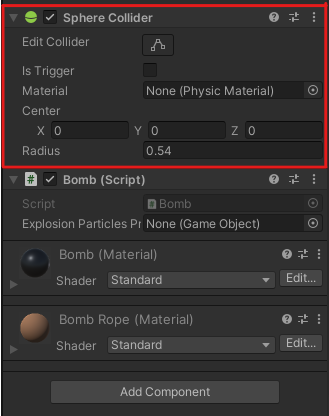

# Bombas 2

| Transformación      | Malla de renderizado        |
|:-------------:|:---------------:|
|Indicamos la:  Posición, Rotacion, Escala de un elemento|Para que se pueda visualizar con un material en concreto sombras luz….|
|||
|**RigidBody**|**Sphere Collider**|
|Son las instrucciones que se le dan al elemento, para que tenga unas físicas en concreto.    Ejemplo: Gravedad.|Se utiliza para indicar las zonas de colisión.   Mas conocido como hitbox|
|||
