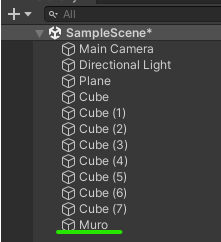
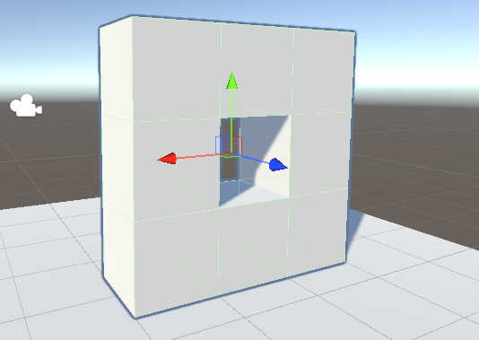
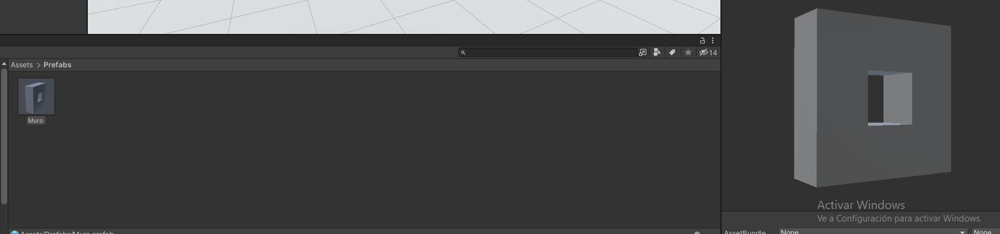
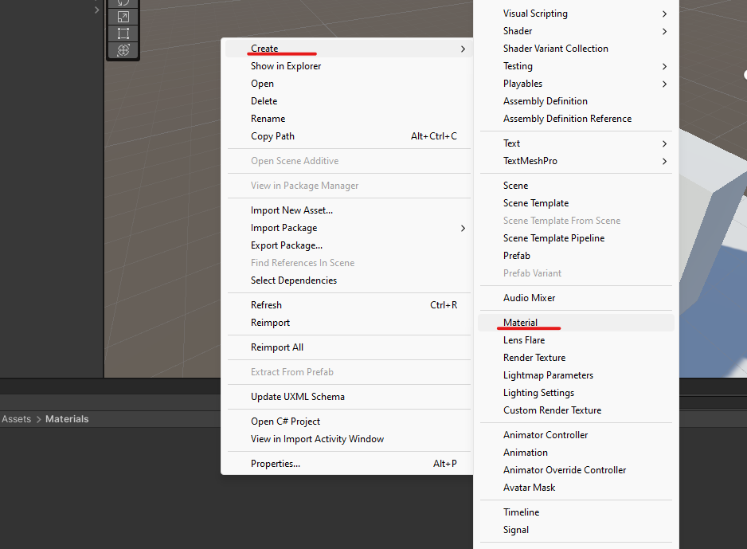
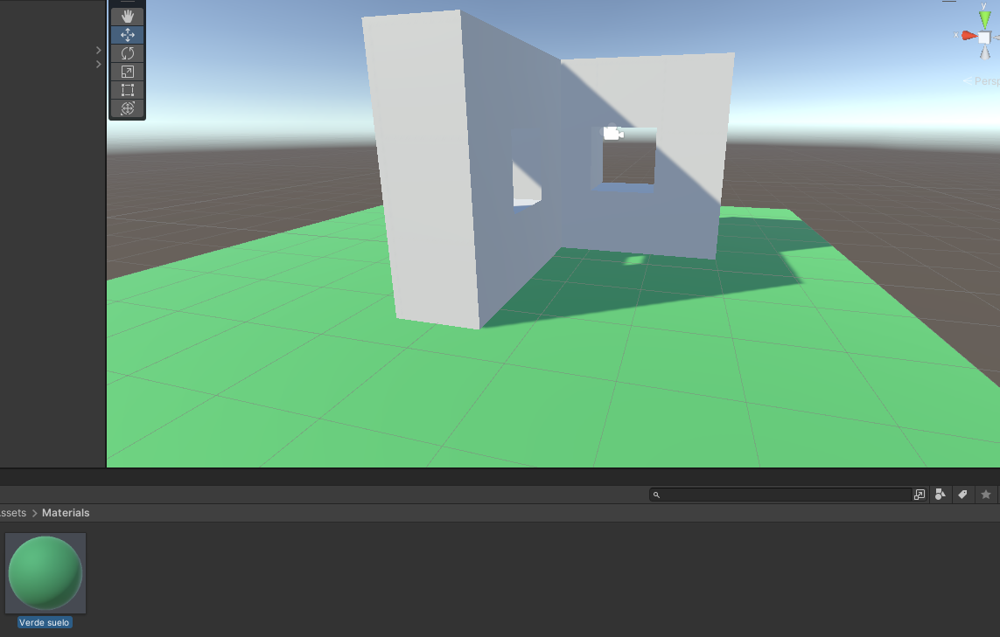

# 2. Introducción Unity - 2

# ¿Cómo crear 1 muro con varios bloques?

Si queremos pegar 1 bloque a otro y que no nos quede una separación muy fina

  

(en caso de que sean 2 elementos iguales)

- Tenemos 1 solo cubo lo copiamos usando `ctr + d`
- El nuevo cubo estará en la misma posición que el original y ahora lo movemos manteniendo la tecla control
    
    

      
    

    
- Repetimos varias veces y podremos crearnos un muro

  

### Ajustes de snapping

En la parte superior de la ventana se localizara esta opción aquí podemos modificar los parámetros de tal manera que podremos: mover, rotar, escalar con unos valores fijos.

  

# GameObject vacío

Esto nos será útil para unir varios elementos haciendo que se comporte como uno solo

1. Creamos el Empty GameObject
    
    

      
    

    
2. Una vez creado le hacemos reset a la posición de este
    
    

      
    

    
3. Colocamos el GameObject en el centro de esta pared (ya que es el centro del objeto y nos facilitara el movimiento de este)
    
    

      
    

    
4. Renombramos el GameObject

<table align="center">
	<tbody>
		<tr>
			<td></td>
			<td></td>
		</tr>
	</tbody>
</table>

1. Añadimos todos los cubos al GameObject
    
    

      
    

    
2. Ahora si seleccionamos la etiqueta muro podemos moverla como una sola pieza
    
    

      
    

    

## Guardar elementos

Nos vamos a la carpeta de Assest

  

Hacemos click derecho y creamos una carpeta que se llame prefabs y arrastramos el GameObject→Muro

  

Ahora en esta carpeta tendremos guardado el componente y lo podremos usar como plantilla para así poder sacar mas elementos como este.

  

# Materiales

Nos vamos a la carpeta de Assest

  

Y creamos una carpeta que se llame Materails

Dentro le damos click derecho y accedemos a Create→Material

  

Nos saldrá un nuevo material y le podremos dar color textura opacidad…

  

Ahora podemos arrastrar este material a cualquier elemento de la escena para que tenga ese color

  

# Imantar esquinas

Otra manera de unir objetos es imantando las equinas esto se hace manteniendo la tecla v y luego el ctr

  

