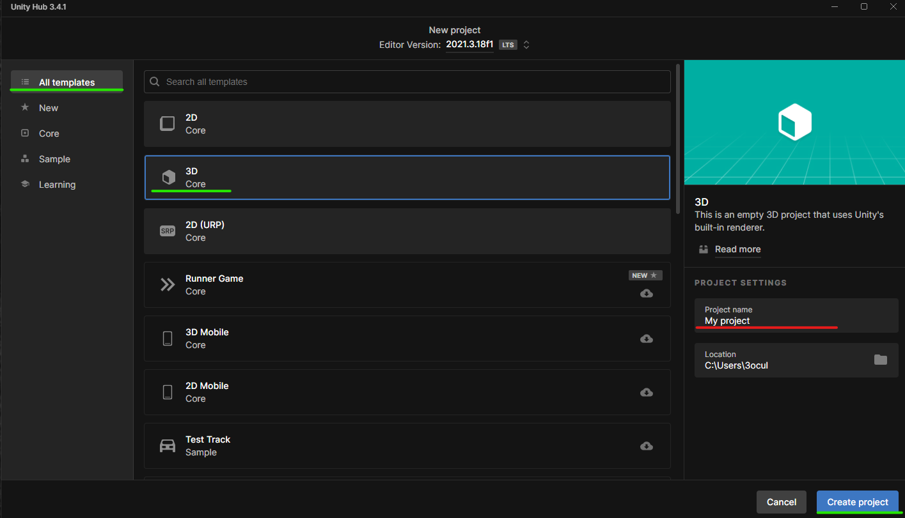

# Creación de proyecto

|       |         |
|:-------------:|:---------------:|

## Editor por defecto

Para que Visual Studio este como editor por defecto lo tendremos que hacer de la siguiente manera.

  

