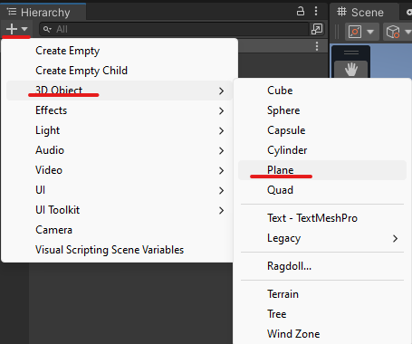
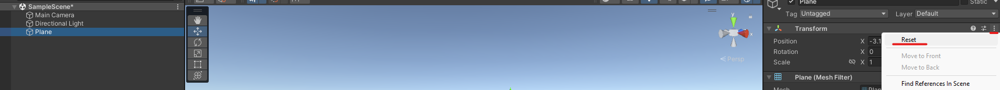
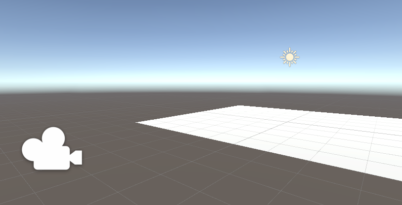
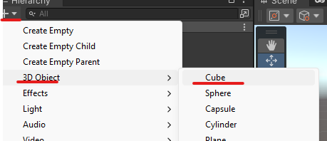
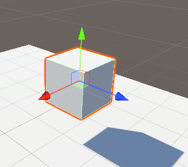
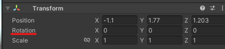
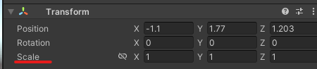

# 1. Introducción Unity - 1

## Añadir un suelo a la base

Para sacar un suelo tendremos que seguir lo siguientes pasos

|       |         |
|:-------------:|:---------------:|

Luego para colocar el suelo en la posición central hacemos lo siguiente

|       |
|:-------------:|
| |

## Alinear vista con la escena

Cuando haces esto se colocara la vista de la cámara con la visión que tengamos del plano.

  

# Elementos

Añadimos un cubo

  

## Posición

Para mover objetos

- Flechas
    
    <table align=center>
        <tbody>
            <tr>
                <td></td>
                <td>Y → Arriba - Abajo   X → Derecha - izquierda  Z → Profundidad</td>
            </tr>
        </tbody>
    </table>

- Tabla de números.

  

## Rotación

Rotamos las caras del cubo

- Marcamos la opción de rotar y usamos los círculos
    
    

      
    

    
- Tabla de números.
    
    

      
    

    

## Escalado

Cambiamos el tamaño del cubo

- Marcamos la opción de escalado y usamos las flechas
    <table>
        <tbody>
            <tr>
                <td></td>
                <td>Y  → Largo   X → Ancho  Z → Profundidad</td>
            </tr>
        </tbody>
    </table>

- Tabla de números

  

