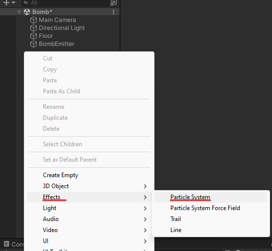
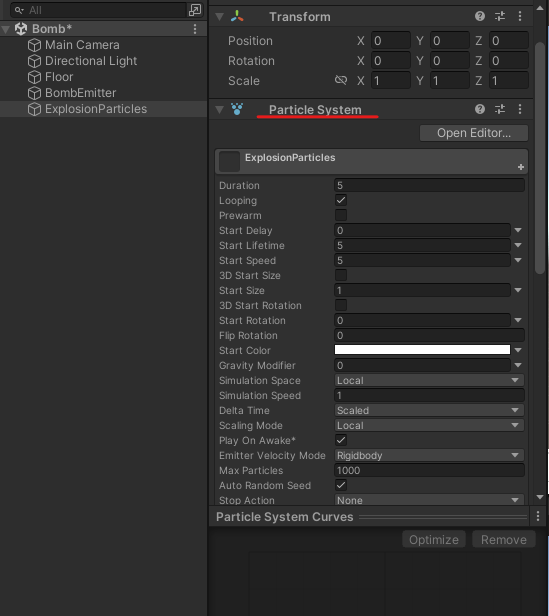
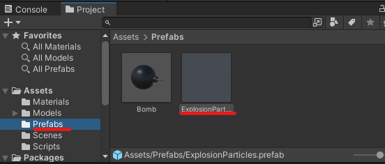
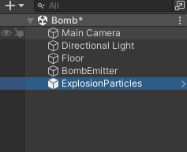
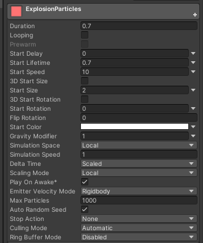
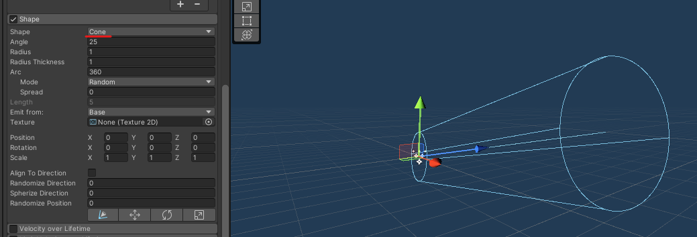

# Bombas 4

> Para añadir elementos tenemos que estar fuera de la reproducción del programa
> 

Lo podremos ver cuando los botones de la parte superior NO estén azules

|       |         |
|:-------------:|:---------------:|

# ¿Cómo hacer un efecto de explosión?

Nos vamos a los elementos que tenemos en el proyecto y añadimos un elemento de partículas, le daremos el nombre **ExplosionParticles**

  

Hacemos reset a su posición

En caso de que no este añadido, tendremos que añadir el componente 

  

Lo añadimos a la carpeta de Prefabs

  

Y lo eliminamos de la zona de trabajo ya que queremos generarlo en 1 momento indicado y no queremos que el programa arranque con este elemento

|       |         |
|:-------------:|:---------------:|

Accedemos a los parámetros de Particle System

  

Ahora en el buscador del proyecto tenemos que localizar el material que le queremos agregar a las partículas y lo arrastramos.

  

- Duration: Duración de la animación.
- Loop: Cuando se termina la animación vuelve a empezar (Desactivamos esto ❌)
- Duration Lifetime: Tiempo de vida con el que empieza.
- Duration Speed: Velocidad con la que comienza.
- Start Size: Tamaño de la partícula
- Gravity Modifider: Si esta a 0 no le afectara la gravedad a nuestras partículas (lo cual lo pondremos a uno)

  

## Emissioon

- Rate over Time: Numero de partículas que se generan
    
    

      
    

## Shape

- Shape: indica la forma de propagación que tendrá las partículas
    
    

      
    

    

## Color over LifeTime

Tendremos que marcar esta función para poder utilizarla.

La opción nos permitirá cambiar los colores/intensidad que tendrán las partículas en su tiempo de vida

- Las pestañas superiores son para la intensidad
- Las pestañas inferiores son para los colores

    

      
    
