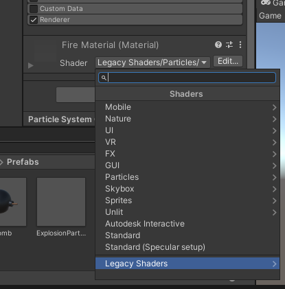
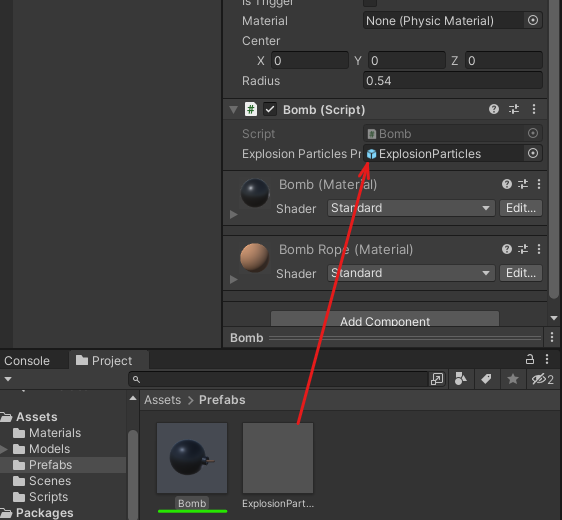
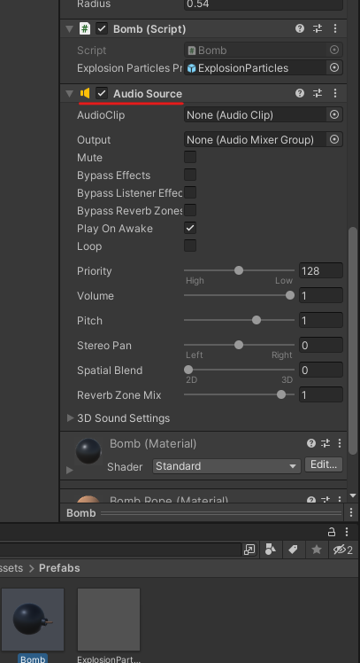
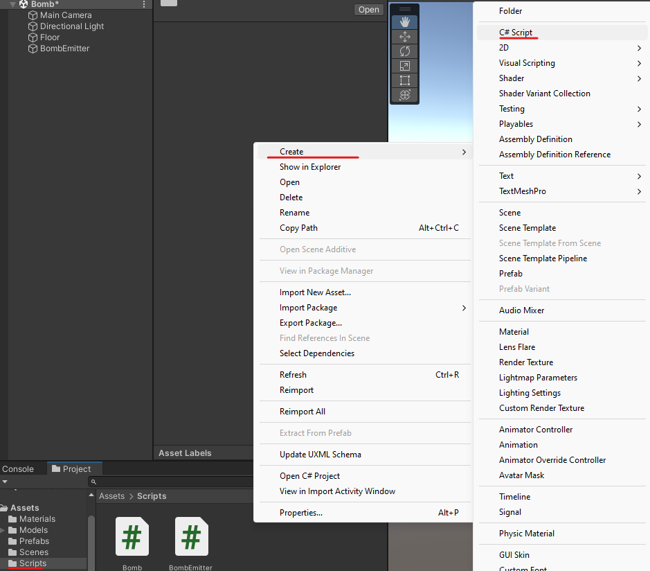
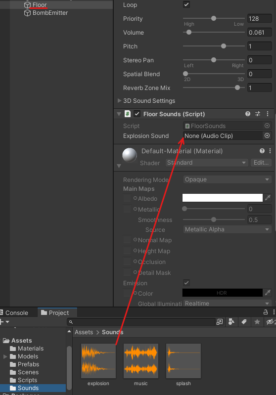

# Bombas 5

# Tipo de partículas

Podemos indicar el tipo de partícula en renderer


<table>
	<tbody>
		<tr>
			<td></td>
			<td></td>
		</tr>
		<tr>
			<td></td>
			<td></td>
		</tr>
	</tbody>
</table>

# Añadir efecto explosión

Para que la animación de explosión se ejecute **nos tenemos que ir a la bomba** y añadimos el efecto en el apartado de explosión de partículas

<p align="center">
  
</p>

<table>
	<tbody>
		<tr>
			<td></td>
			<td></td>
		</tr>
	</tbody>
</table>

# Efectos de sonido

Dentro de Assets nos tendremos que crear una carpeta que se llame Sounds y añadiremos los efectos de sonido que queramos

<p align="center">
  
</p>

## Sonido generar bomba

- Ahora nos vamos a la bomba y le añadiremos el componente Audio Source
    
    <p align="center">
      
    </p>
    
- Y añadiremos el sonido que sonara al generarse la bomba
    
    <p align="center">
      
    </p>
    

## Sonido de fondo

- Al suelo le agregaremos el sonido de fondo y lo pondremos en loop para que suene mientras se este ejecutando el programa

    <p align="center">
      
    </p>

## Sonido explosión

- Para gestionar el sonido de la explosión lo hacemos mediante código por 2 razones.
    - El suelo ya tiene un sonido
    - El audio de la explosión se accionara cuando toque el suelo.

Para eso nos vamos a Assets→Scripts y creamos un archivo C# en mi caso le dare el nombre de FloorSounds.

<p align="center">
  
</p>

```csharp
AudioSource floorAudioSource;//Componente que acciona los audios
public AudioClip explosionSound;//variable que guarda el sonido de la explosion

// Start is called before the first frame update
void Start()
{
  floorAudioSource = GetComponent<AudioSource>();//inicializamos la variable que acciona los audios
}

//el audio de la explosion sonara 
//cuando la hitbox de la bomba toque el suelo
private void OnCollisionEnter(Collision collision)
{
  //PlayOneShot   permite a un elemento reproducir varios audios
  floorAudioSource.PlayOneShot(explosionSound);
}

```

- Una vez guardado el script lo añadimos al suelo. 
(Ya sea arrastrandolo o en la opción añadir Componente)
    
    <p align="center">
      
    </p>
    
- Ahora añadimos el sonido al script
    
    <p align="center">
      
    </p>