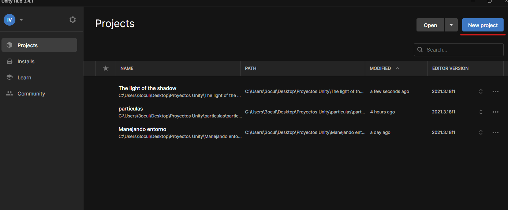
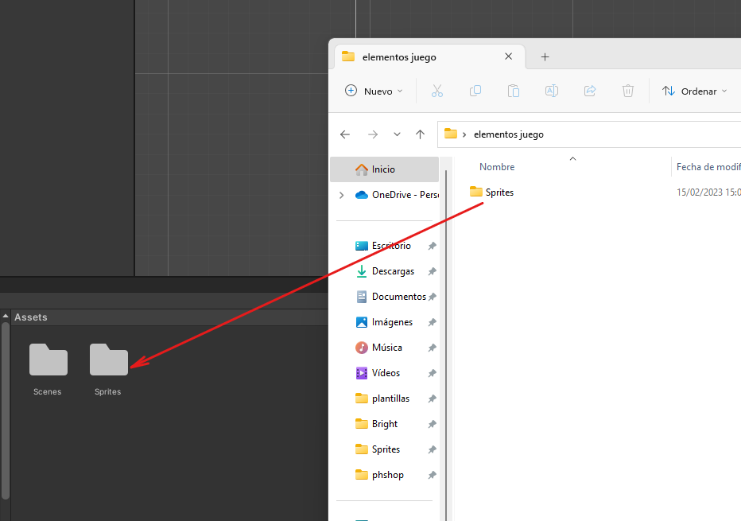

# 1. Configuración del proyecto

Vamos a crear un juego 2d para eso tendremos que darle el boton de nuevo proyecto

  

Marcar la opción de 2d y darle un nombre.

  

## Elementos del juego

Podemos visitar en diferentes [web](https://craftpix.net) que nos proporcionen los elementos que usaremos en el juego

  

