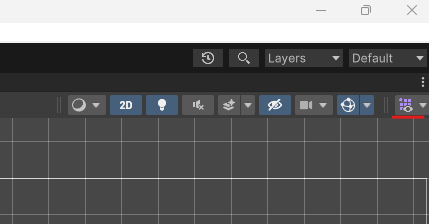
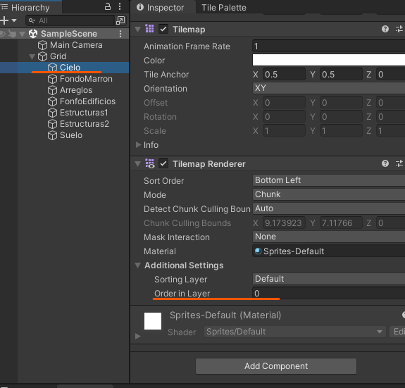

# 2. Diseño de nivel

- Para crear en mundo tenemos que hacer lo siguiente
    - Los tilemap son capas que usaremos para ver el juego ejem→ suelo, cielo..

  

## Elementos

Pillamos uno de los Sprite que tenemos, en caso de que sean varios elementos en 1 Sprite le indicamos que es multiple y luego nos vamos al **Sprite Editor**

  

Al ser 3 elementos grandes solo tendremos que marcar su tamaño

### Creamos una paleta

Para eso le damos al botón que esta arriba ala derecha y en el desplegable que nos saldrá le daremos a la opción de crear una paleta le tendremos que decir una carpeta en la que se guardara.

|  |  |
| ------------- | ------------- |

Arrastramos los elementos al Tile Palette tendrán que estar cortados si hay varios en una sola foto

  

### Capas

Cuanto mas cerca del 0 este mas al fondo quedara el elemento con esto podemos colocar elementos como el cielo que den igual que un edificio los bloque.

  

Este será mi nivel

  

