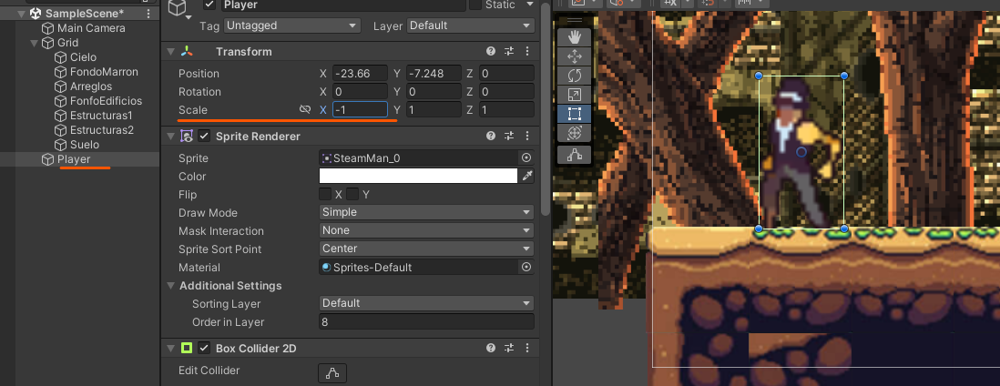

# 4. Volteo del Player

Para voltear el personaje tenemos 2 opciones

1. Cambiando la escala de 1 a -1
    
	<p align="center">
	  
	</p>
    
	<p align="center">
	  
	</p>
    
2. Opción de Flip indicamos que eje es el que queremos rotar.
    
	<p align="center">
	  
	</p>
    
	<p align="center">
	  
	</p>
    

## Codigo

```csharp
private SpriteRenderer flipPlayer;//declaramos variable para acceder al componente

//cuando arranquemos el programa
void Start()
{
  flipPlayer = GetComponent<SpriteRenderer>();//optenemos el componente Sprite Render
}

//mientras se ejecuta el programa
void Update()
{
  //como nos vamos a mover en todo momento tendra que estar en Update la recepcion
  movementX = Input.GetAxis("Horizontal");
  if (movementX > 0)//si se mueve a la derecha
  {
    flipPlayer.flipX = false;
  }
  if (movementX < 0)//si se mueve a la izquierda
  {
    flipPlayer.flipX = true;
  }
}

```