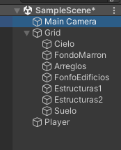
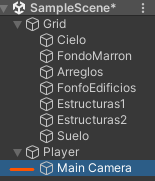

# 5. Cámara sigue al Player

Para hacer que la cámara se mueva junto al player lo que tenemos que hacer es:

Ir arrastrar la cámara al player para que así se convierta en su hijo.

|  |  |
| ------------- | ------------- |

Para que el personaje no se tambalee al subir una rampa o cuando esta cayendo tenemos que marcar esta opción

  

