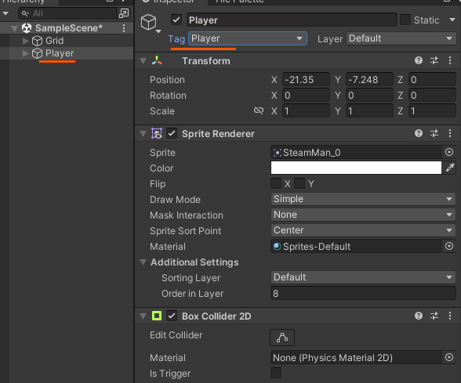
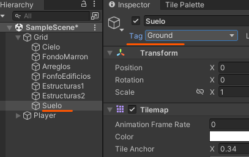

# 7. Salto - 2

Ahora tenemos que hacer que el personaje solo pueda saltar cuando este en el suelo

### Player

Le tenemos que añadir etiquetas para así saber que elemento a colisionado.

<p align="center">
  
</p>

### Suelo

Al suelo le tendremos que crear una etiqueta y a la cual le daremos el nombre de Ground

|  |  |
| ------------- | ------------- |

Y ahora podremos añadírsela.

<p align="center">
  
</p>

## Código

```csharp
private bool isGround = true;//booleano para saber si esta en el suelo

//****  añadimos la el booleano de colision al if  ****
void Update()
{
  if((Input.GetKeyDown(KeyCode.UpArrow) || Input.GetKeyDown(KeyCode.W)) **&& isGround**)
  {
    playerRb.AddForce(Vector2.up * jump, ForceMode2D.Impulse);
  }
}

private void OnCollisionEnter2D(Collision2D collision)//nos avisa SI el player esta tocando el suelo
{
  if (collision.gameObject.tag == "Ground" )//comprobamoss que con lo que se esta colisionando es el suelo
  {
    isGround = true;
  }
}

private void OnCollisionExit2D(Collision2D collision)//nos avisa si el player NO esta tocando el suelo
{
  //comprobamoss que con lo que se esta colisionando es el suelo
  //!!!!   Como el metodo es colisionExit se esta comprobando que no hay colision con ese elemento    !!!!!
  if (collision.gameObject.tag == "Ground")
  {
    isGround = false;
  }
}
```