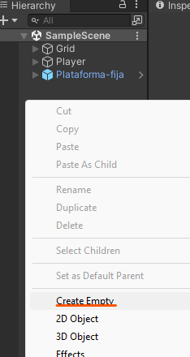
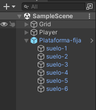
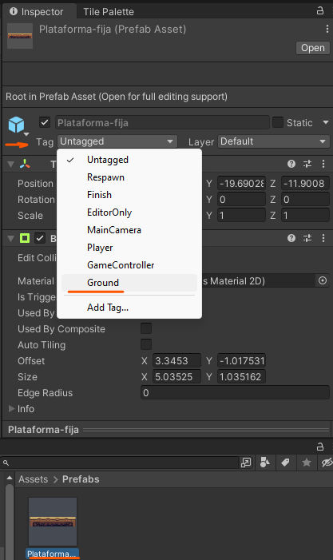
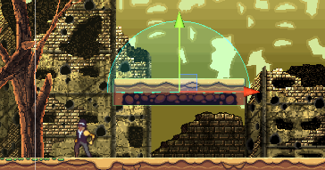

# 8. Plataformas fijas

Tendremos que añadir los sprites a los elementos del programa

  

Luego le tendremos que dar una posición en la jerarquía de capas de tal manera que se pueda visualizar o q este detrás de algunos elementos

  

Creamos una carpeta a la que llamaremos Prefabs

  

Creamos un elemento Empty le damos el nombre que queramos que tenga la plataforma.

  

Añadimos dentro de el todos los sprites

  

Por ultimo arrastramos este elemento a la carpeta de Prefabs para así guardar el elemento y poder trabajar con el cuando lo necesitemos

  

## Colisión a la plataforma

Ahora mismo nuestro personaje no se podrá subir a la plataforma ya que no tiene colisiones.

Para solucionar esto accedemos a nuestra plataforma y le damos a open.

  

Le añadimos el componente de Box Collider 2D

  

Una vez añadido el elemento le damos al botón de Edit Collider y nos saldrá un cuadrado verde **(En caso de que no veas el cuadrado verde haz zoom out y aparecera)**

Por ultimo tendremos que delimitar el tamaño de la plataforma.

  

Ahora nos podremos subir en esa plataforma pero no saltar. Esto ocurre ya que la plataforma no la cuenta como suelo.

  

## Plataformas para saltar por debajo

Añadimos el componente Platform Effector 2D

  

Cuando lo añadamos nos tendremos que ir al Box Collider 2D y marcamos el checkBox de use by effector

  

Y ya se podrá subir por debajo 

  

