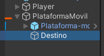
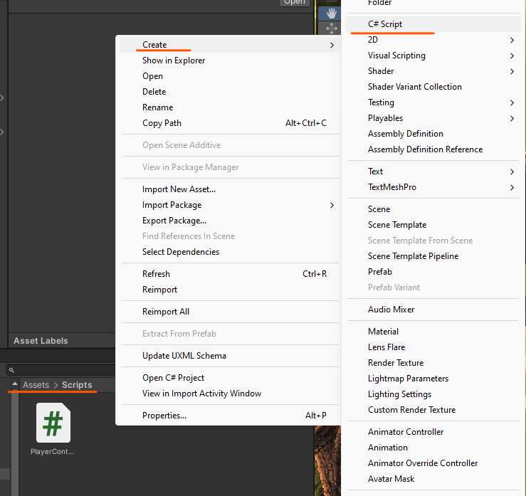

# 9. Plataformas móviles - 1

Seguimos los pasos de **8. Plataformas fijas** para crear un Prefab de la plataforma que utilizaremos

Además de eso creamos un elemento Empty que usaremos para saber hasta donde se moverá la plataforma.

<p align="center">
  
</p>

Crearemos otro elemento vacío y lo usaremos como padre de la plataforma y del destino (tendremos que añadir estos dos al nuevo elemento)

<p align="center">
  
</p>

## Código

Creamos un script que se llame plataforma móvil.

<p align="center">
  
</p>

```csharp
public Transform target;//variable para la posicion del destino
private float speed = 0.70f;//variable para velocidad de la plataforma
private Vector3 start, end;

void Start()
{
  start = transform.position;//posicion de inicio de la plataforma
  end = target.position;//posicion final de la plataforma
}

void Update()
{
  //MoveTowards -> te vas a mover desde transform.position hasta target.position a esta velocidad speed * Time.deltaTime
  transform.position = Vector3.MoveTowards(transform.position, target.position, speed * Time.deltaTime);

  //
  if (transform.position == target.position)//si llegamos al destino
  {
    if (target.position == end)//si el destino es end
    {
      target.position = start;//cambiamos el destino de sitio para que cambie de sentido (para que vuelva)
    }
    else 
    {
      target.position = end;
    }
  }
}
```

🟥Añadimos el script a la plataforma

🟩Le tenemos que indicar al target cual será la ubicación de destino.

<p align="center">
  
</p>