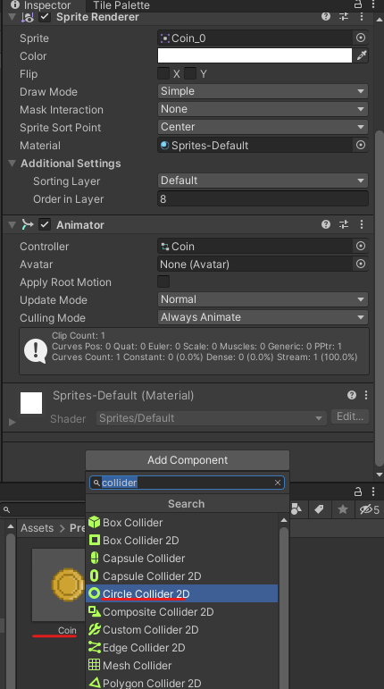
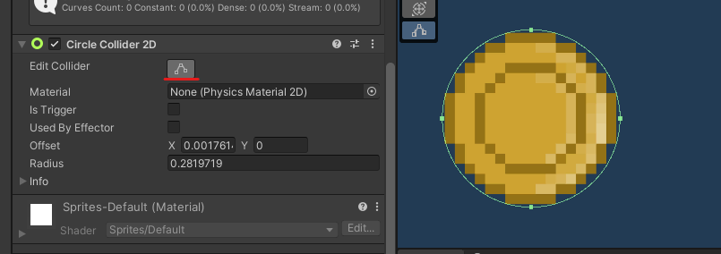
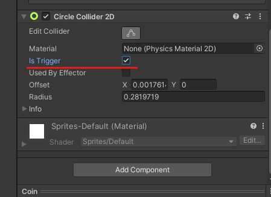

# 12. Recolección de monedas-puntos

Arrastramos la moneda a la carpeta Prefab y vamos colocando monedas por el mapa

|       |         |
|:-------------:|:---------------:|

Ahora tenemos que hacer que el personaje entre en colisión con la moneda de tal manera que cuando esto ocurra la contemos como recolectada.

## Colisión de la moneda

Nos vamos al Prefab de la moneda y le añadimos el componente Collider 2D que más se ajuste a la forma de nuestro elemento, en mi caso será el circulo.

<table>
	<tbody>
		<tr>
			<td rowspan="2"></td>
			<td>Ajustamos el tamaño de la colisión del elemento para que encaje con la moneda.</td>
		</tr>
		<tr>
			<td></td>
		</tr>
	</tbody>
</table>

Marcamos la opción de Trigger para que se pueda atravesar el elemento

<p align="center">
  
</p>

Creamos en la carpeta Script un C# que se llamara CoinController, lo usaremos para detectar la colisión con la moneda.

```csharp
public class CoinController : MonoBehaviour
{
  //al ser static estamos haciendo que la variable sea compartida por el resto de monedas
  private static int points = 0;//contador inicia a 0 ya que aun no tenemos monedas

  private void OnTriggerEnter2D(Collider2D collision)//colision cn la moneda
  {
    if (collision.tag == "Player")//si qn colisiono cn la moneda es el player
    {
      points += 2;//sumamos los puntos al recoger monedas
      //Debug.Log("puntos " + points);//mensaje por terminal
      Destroy(gameObject);//destruimos la moneda que acabamos de recoger
    }
  }

}
```