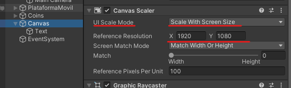
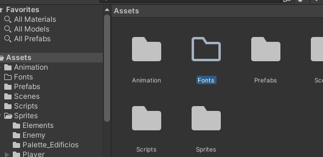
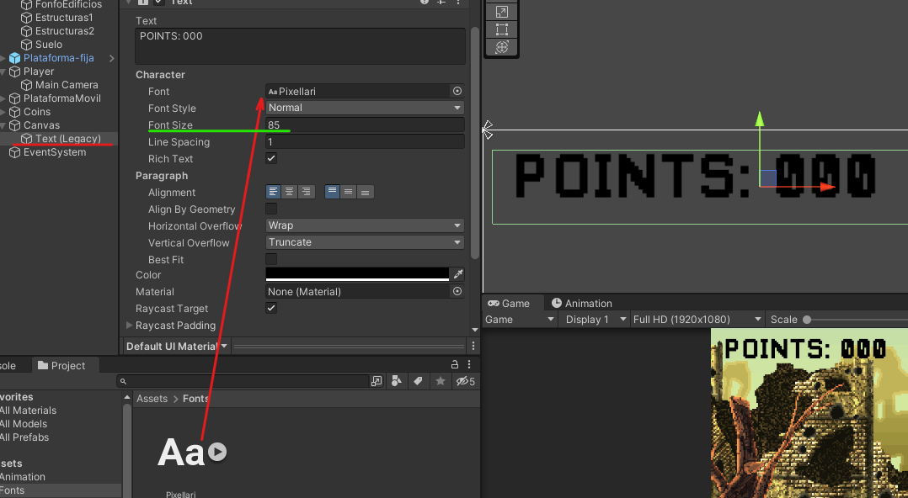
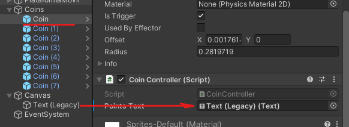

# 13. HUD

HUD (**Head-Up Display)** → Es la información que aparece en la pantalla que nos proporciona datos como: vida, munición, nivel…. del personaje

Creamos el canvas y le añadimos un texto dentro de el, haciendo así que se convierta en su hijo.

|       |         |
|:-------------:|:---------------:|
</br>

<p align="center">
  
</p>

<p align="center">
  
</p>

La caja de texto la tendremos que anclar arriba a la izquierda, para eso mantenemos la tecla alt y shift mientras hacemos click en la casilla

|       |         |
|:-------------:|:---------------:|

Creamos una carpeta que se llame Fonts y le añadimos la fuente que queramos utilizar.

<p align="center">
  
</p>

<p align="center">
  
</p>

Le damos un tamaño, tipografía, texto…

<p align="center">
  
</p>

 

## Código

Accedemos a la variable para cambiar el texto de la puntuación.

```csharp
using UnityEngine.UI;//libreria para el text

public class CoinController : MonoBehaviour
{
  public Text pointsText;

  private void OnTriggerEnter2D(Collider2D collision)//colision cn la moneda
  {
    if (collision.tag == "Player")//si qn colisiono cn la moneda es el player
    {
      points += 2;//sumamos los puntos al recoger monedas
      **pointsText.text = " POINTS: " + points.ToString();//accedemos al texto de la ui para añadir los puntos**
      Destroy(gameObject);//destruimos la moneda que acabamos de recoger
    }
  }

}
```

Añadimos la caja de texto a la moneda

<p align="center">
  
</p>

Ahora en la misma moneda nos vamos a overrides y le aplicamos el cambio a las demás monedas

<p align="center">
  
</p>

> En caso de que no pille el override lo tendremos que añadir uno a uno
> 

<p align="center">
  
</p>