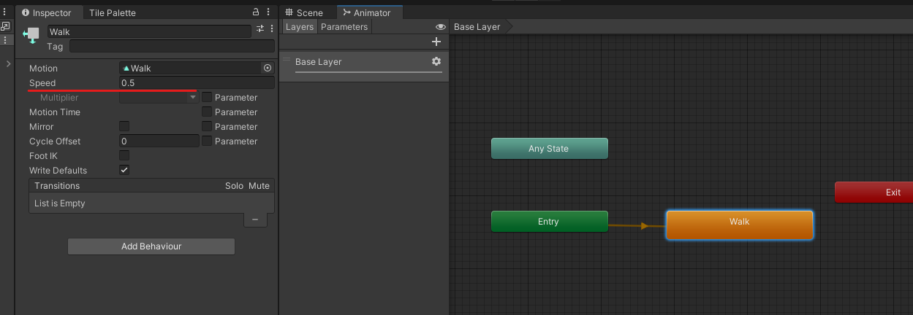

# 15. Enemigos

Añadimos un sprite de zombie a la escena.

Recortamos el sprite del zombie

|  |  |
| ------------- | ------------- |

Le arrastramos todos los sprites recortados para asi crear una animacion y la guardamos en Animation

<p align="center">
  
</p>

A la animación le indicamos una velocidad

<p align="center">
  
</p>

## Código

Hacemos que el zombie se mueva a la posición del personaje.

```csharp
private Transform playerPosition;//variable donde se almacenara la posicion del player
private SpriteRenderer flipPlayer;//declaramos variable para acceder al componente
public float speed = 3.0f;

void Start()
{
  playerPosition = GameObject.Find("Player").transform;//posicion
  flipPlayer = GetComponent<SpriteRenderer>();
}

void Update()
{
  transform.position = Vector3.MoveTowards(transform.position, playerPosition.position, speed * Time.deltaTime);
  if (playerPosition.position.x < transform.position.x)//si el personaje esta a la izq del zombie
  {
    flipPlayer.flipX = true;
  }
  if (playerPosition.position.x > transform.position.x)//si el personaje esta a la izq del zombie
  {
    flipPlayer.flipX = false;
  }
}
```

Por ultimo arrastramos el código al enemigo

<p align="center">
  
</p>