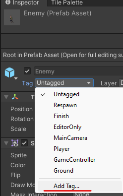
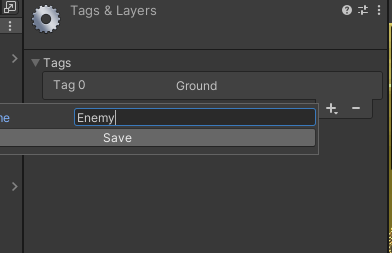
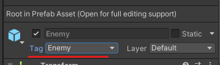

# 17. Matar player

Le tendremos que crear un tag al zombie

<table>
	<tbody>
		<tr>
			<td rowspan="3"></td>
			<td></td>
		</tr>
		<tr>
			<td>Añadimos el tag al zombie</td>
		</tr>
		<tr>
			<td></td>
		</tr>
	</tbody>
</table>

## Código

```csharp
public GameObject camara;//camaba para cuando el player muera siga mostrando el juego

private void OnCollisionEnter2D(Collision2D collision)//nos avisa SI el player esta tocando el suelo
{
  if (collision.gameObject.tag == "Enemy")
  {
    Debug.Log("muerto");
    camara.transform.parent = null;//independizamos la camara para que se siga viendo
  Destroy(gameObject);//destruimos al player
  }

}
```