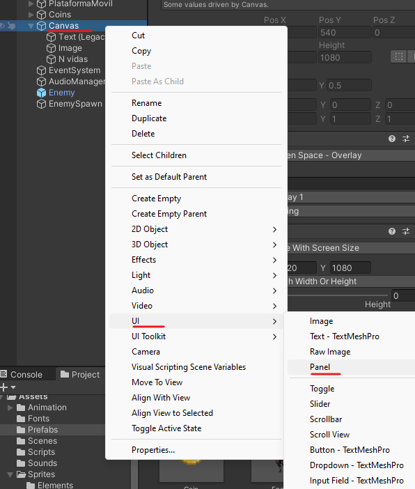
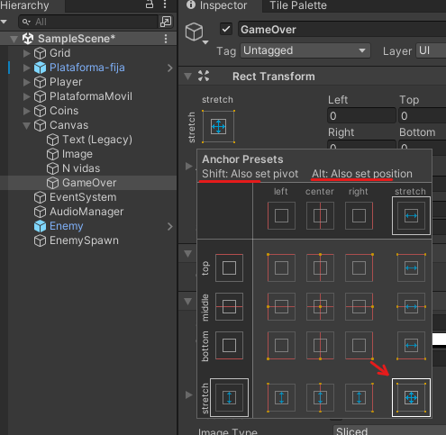
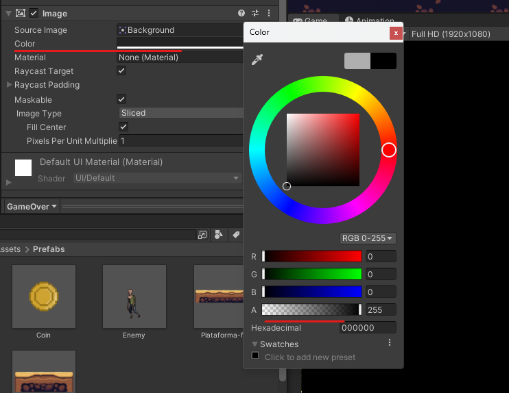
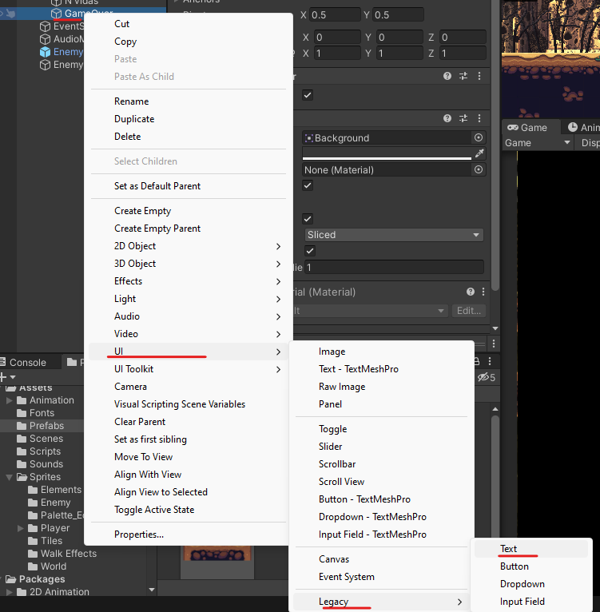
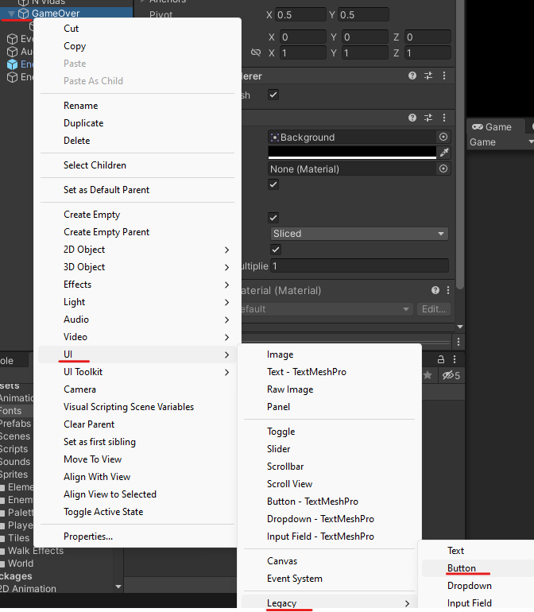
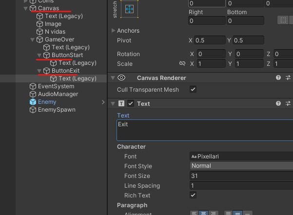
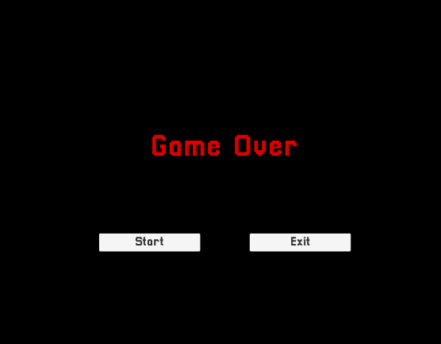
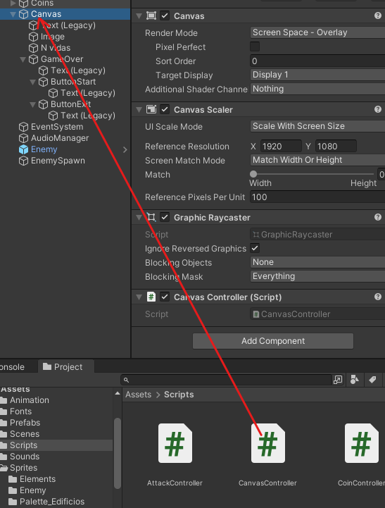
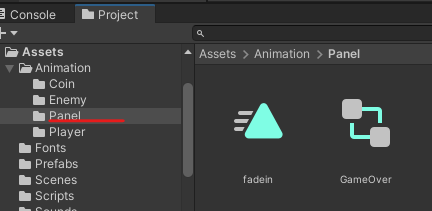

# 19. Pantalla fin del juego

Sacamos un panel y le daremos el nombre GameOver

<p align="center">
  
</p>

Lo colocaremos en Stretch para que este colocado al máximo en cualquier resolución

<p align="center">
  
</p>

Le damos un color

<p align="center">
  
</p>

Ahora al Panel le añadiremos unos botones y un texto.

<p align="center">
  
</p>

Le añadimos 2 botones

<p align="center">
  
</p>

Le cambiamos el texto, tamaño…. a los botones

|  |  |
| ------------- | ------------- |

Nos creamos un Script que se llamara CanvasController lo usaremos para manejar los botones

```csharp
using UnityEngine.SceneManagement;

public void Reiniciar() 
{
  SceneManager.LoadScene("SampleScene");
}

public void Salir()
{
  Application.Quit();
}
```

Añadimos el Script al Canvas

<p align="center">
  
</p>

Ahora al botón le tendremos que indicar quien tiene el Script y le indicamos que método queremos ejecutas.

<p align="center">
  
</p>

Ahora tenemos que desmarcar el tag para que podamos ver la pantalla y cuando muera lo activaremos

<p align="center">
  
</p>

Vamos a hacer que el panel dure un poco en aparecer para eso nos vamos a la pestaña Animation del panel 

<p align="center">
  
</p>

Guardaremos la animación en Assets→Animation→Panel

<p align="center">
  
</p>

## Animación

- 1º frame de la animación tendremos que poner.
    - Opacidad del color→ al mínimo
    - Botones → Para que **NO SE** vean tendrán que estar desactivados (el checkbox del tag)

  <p align="center">
    
  </p>

- 2º frame de la animación tendremos que poner.
    - Opacidad del color→ al máximo.
    - Botones → Para que **SE** vean tendrán que estar desactivados (el checkbox del tag)

  <p align="center">
    
  </p>

<p align="center">
  
</p>

La pantalla de winner se hace igual