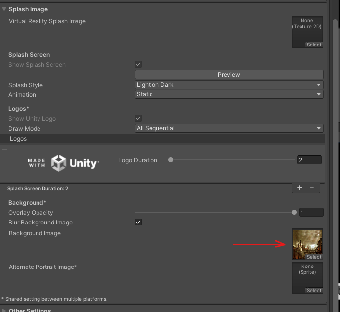

# 21. Creación de ejecutable

Nos vamos a Build Settings

  

Player Settings

  

Le damos nombre icono…

  

Podemos añadir una imagen de fondo mientras sale el logo de unity

  

Por ultimo le damos a Build

  

