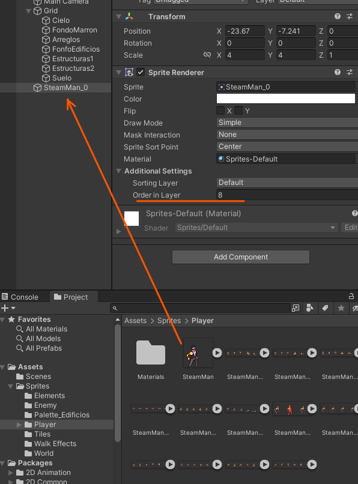
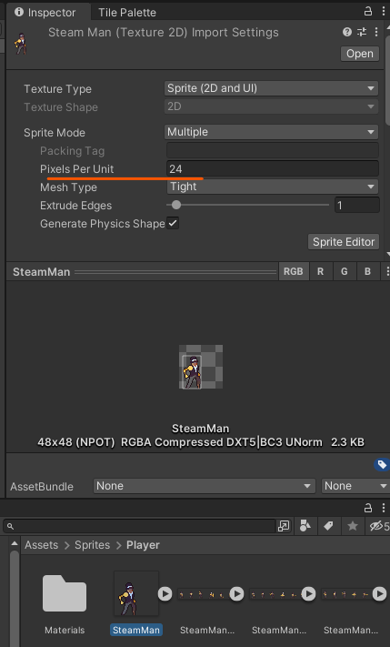
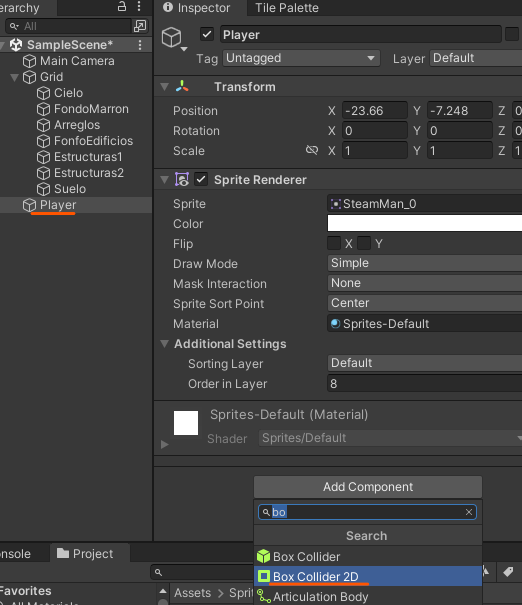
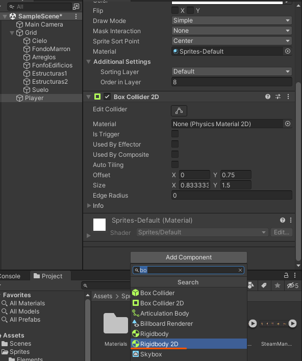
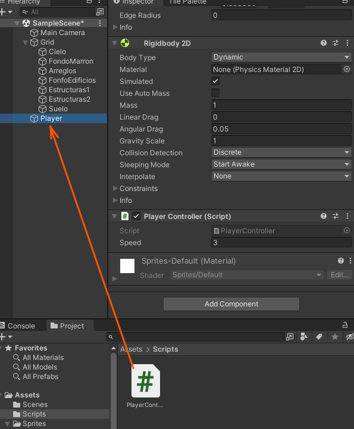
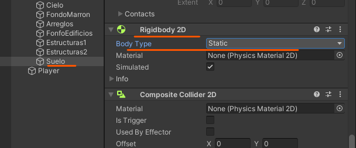

# 3. Movimiento Player

Nos vamos a nuestra carpeta de sprites y recortamos los sprites del personaje.

<p align="center">
  
</p>

Tendremos que indicarle que sea múltiple

<p align="center">
  
</p>

Cuando recortemos el personaje tendremos que indicar, que el pivot se localizara en la base (bottom center)

<p align="center">
  
</p>

Lo arrastramos y le damos un nivel de capa para que se pueda visualizar dependiendo de cual sea este habrá elementos que se verán por encima del personaje.

<p align="center">
  
</p>

Si queremos hacer que el elemento se vea mas grade le disminuimos el numero de pixeles por unidad

<p align="center">
  
</p>

## Colisión con el personaje

Le tendremos que añadir colisiones al personaje para que pueda interactuar con los elementos.

<p align="center">
  
</p>

## Gravedad

Para que le afecte la gravedad le añadiremos el Rigidbody 2d

<p align="center">
  
</p>

# PlayerController

Nos creamos un archivo C# que se localizara en la carpeta Assets→Scripts

### Start

Se ejecuta nada más iniciar el juego es decir en el frame 1 y no se vuelve a ejecutar.

> Se usa para inicializar variables….
> 

### Update

Se ejecuta 60 veces por segundo

> Se usa para movimiento y cosas asi….
> 

### Teclas movimiento

Unity por defecto tiene configuradas una teclas por defecto.

|  |  |
| ------------- | ------------- |

### Código de movimiento

1. El movimiento del personaje será detectado por las teclas a d o der izq cuando sean pulsadas añadirá -1 o 1.
2. Para hacer que el movimiento del personaje sea mas rápido lo multiplicamos por un numero cuanto mas grande este mas rápido ira.
3. **Time.deltaTime**→ limita la velocidad de frames y lo pasa a segundos

```csharp
public float speed = 3.0f;

void Update()
{
  transform.position += new Vector3( Input.GetAxis("Horizontal") , 0, 0) * speed * Time.deltaTime;
}
```

Lo añadimos al player

<p align="center">
  
</p>

## Suelo

Tendremos que añadir los siguientes componentes al suelo esto se hace para que el personaje colisione con el suelo.

|  |  |
| ------------- | ------------- |

Cuando ejecutes esto se caerá tanto el personaje como el suelo para que el suelo se mantenga fijo le tenemos que cambiar lo siguiente

<p align="center">
  
</p>