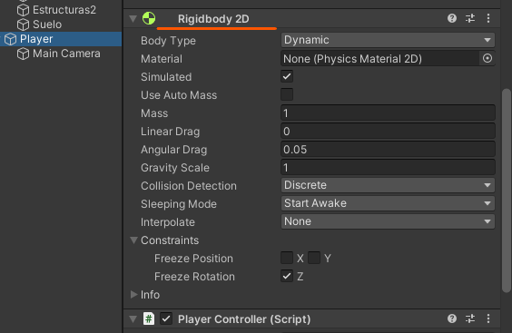

# 6. Salto - 1

Para añadir el salto es obligatorio que el personaje tenga un RigidBody ya que este componente le añade las físicas de gravedad.

<p align="center">
  
</p>

## Código

```csharp
public float jump = 8.0f;
private Rigidbody2D playerRb;//declaramos variable para acceder al componenete

void Update()
{
  if(Input.GetKeyDown(KeyCode.UpArrow))//estamos comprobando si se ha pulsado la tecla "flecha hacia arriba"
  {
    //indicaremos que el personaje sufrira una fuerza hacia arriba
    //diremos de cuanto sera esa fuerza en jump
    //y diremos que tipo de fuerza sera en este caso de impulso
    playerRb.AddForce(Vector2.up * jump, ForceMode2D.Impulse);
  }
}
```