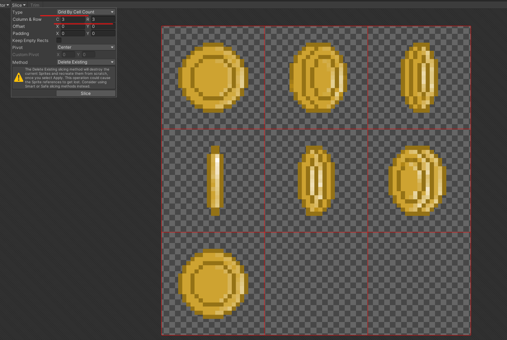
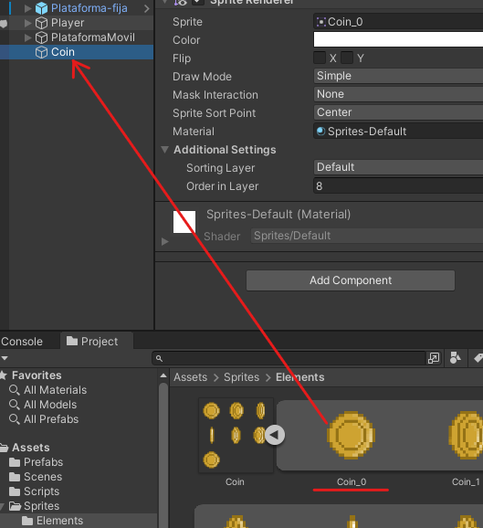
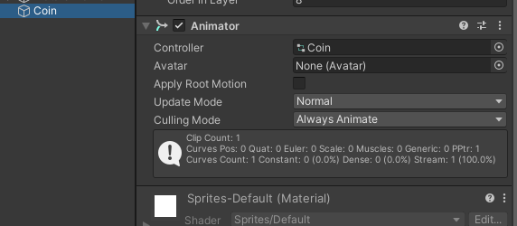
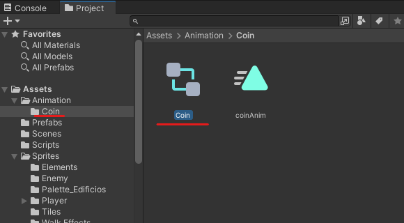
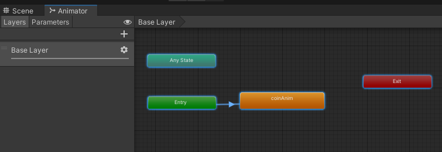

# 11. Monedas

Para darle una animación a las monedas tenemos que tener varias fotos de estas en diferentes posiciones

  

Le indicamos que el sprite este en modo multiple y así podremos recortar las monedas

|       |         |
|:-------------:|:---------------:|

Arrastramos una de las monedas que acabamos de recortar y las añadimos a la escena.

  

Y lo añadimos a la siguiente ruta Assets→Animacion→Coin

  

Accederemos al controlador de animaciones para eso tendremos que acceder a este archivo

  

Tendremos un diagrama de estados asi.

  

Si accedemos al menú de coinAnim podremos cambiar la velocidad con la que se producirá la animación

  

Además si accedemos a CoinAnim podemos decir que se produzca la en bucle

  

