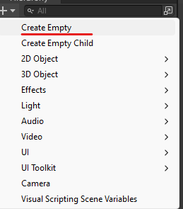
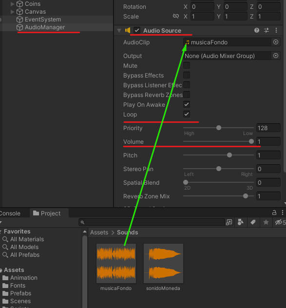
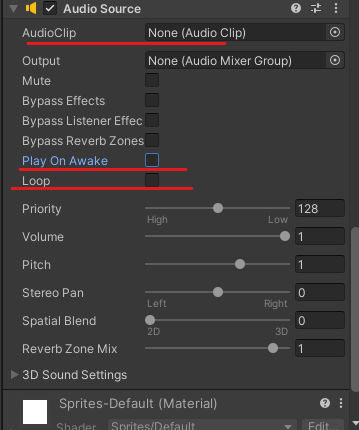

# 14. Sonidos

## Música de fondo

Le añadimos la música de fondo y le marcamos la opción de loop.

|  |  |
| ------------- | ------------- |

## Sonido monedas

Tenemos que hacer que desde el Script de la moneda acceda al Script del personaje

```csharp
private PlayerController playerScrp;
```

Añadimos el audio source al player

<p align="center">
  
</p>

Como tenemos que reproducir muchos sonidos en el player (monedas, salto…..) no le indicaremos ningún audioClip en unity lo añadiremos por código.

<p align="center">
  
</p>

## Código CoinController

```csharp
private PlayerController playerScrp;//Script del PlayerController.cs

void Start()
{
  playerScrp = FindAnyObjectByType<PlayerController>();//buscamos el Script PlayerController.cs

}

private void OnTriggerEnter2D(Collider2D collision)
{
  if (collision.tag == "Player")
  {
    playerScrp.CoinSound();//llamamos al metodo de PlayerController.cs para que suene el audio
    points += 2;
    pointsText.text = " POINTS: " + points.ToString();
    Destroy(gameObject);
  }
}
```

## Código PlayerController

```csharp
private AudioSource audioSource;
public AudioClip audioCoin;

void Start()
{
  audioSource = GetComponent<AudioSource>();//instanciamos la variable audioSource
}

public void CoinSound() 
{
  audioSource.PlayOneShot(audioCoin);//esto pone en marcha el audio de la moneda hay que llamarlo en CoinController.cs
}
```

<p align="center">
  
</p>

Para añadir otro clip de audio solo tendríamos que hacer añadir esto

```csharp
public AudioClip audioJump;

public void metodoX() 
{
  audioSource.PlayOneShot(audioJump);
}
```